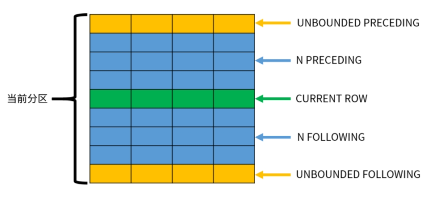

# SQL Tutorial

## 前置

- 关系模型

数据结构：关系  
数据操作：查询和更新  
完整性约束：实体、参照、用户定义  

- 架构

  - PostgreSQL使用一种客户端/服务器的模型
  - 一个PostgreSQL数据库集簇中包含一个或更多命名的数据库。角色和一些其他对象类型被整个集簇共享，连接到服务器的客户端只能访问单个数据库中的数据，在连接请求中指定的那一个

- 数据库基本操作

  - 创建数据库集簇与服务启动

    ```sh
    adduser postgres
    mkdir /usr/local/pgsql/data
    chown postgres /usr/local/pgsql/data
    su - postgres
    initdb -D /usr/local/pgsql/data (pg_ctl -D /usr/local/pgsql/data initdb)
    postgres -D /usr/local/pgsql/data >logfile 2>&1 & (pg_ctl -D /usr/local/pgsql/data -l logfile start)
    ```

  - 创建数据库、创建用户与连接数据库
    - pgsql内置createdb和dropdb, createdb可以有默认值, createdb [-O <role_name>] <db_name>
      - `CREATE DATABASE <db_name> [OWNER <role_name>];`, `DROP DATABASE <db_name>;`
    - createuser name；dropuser name
      - `CREATE ROLE <role_name> [WITH LOGIN PASSWORD 'password'];`, `DROP ROLE <role_name>;`
    - `psql -U <用户名> -d <数据库> -h <ip> -p <port>`; `psql <数据库>`, 若不提供数据库名, 默认值为用户账号名

systemd

```text
[Unit]
Description=PostgreSQL database server
Documentation=man:postgres(1)
[Service]
Type=notify
User=postgres
ExecStart=/usr/local/pgsql/bin/postgres -D /usr/local/pgsql/data
ExecReload=/bin/kill -HUP $MAINPID
KillMode=mixed
KillSignal=SIGINT
TimeoutSec=0
[Install]
WantedBy=multi-user.target
```

### 常用命令

查看数据库

```postgresql
\l [db]

\l+ [db]
```

连接数据库

```postgresql
\c <db>
```

查看表/索引等，可加参数以查看具体对象

```postgresql
\d

\d+

\du或\dg (角色)

\dp或\z (权限分配)

\dn (模式)

\dt (表)

\di (索引)

\df (函数)

\dfn(normal) \dfa(aggregates) \dfw(windows functions) \dft(trigger)

\db (表空间)

\dx (扩展)
```

查看sql命令

```postgresql
\?

\h

\h <cmd>
```

修改密码

```postgresql
\password [user]
```

退出

```postgresql
\q
```

## SQL语法

### 词法结构

#### 注释

- 单行注释

```sql
-- 注释
```

- 多行注释

```sql
/* */
```

#### 标识符与关键字

- 字母、数字和下划线，不能以数字开头
- 关键词和不被双引号修饰的标识符是大小写不敏感的
- 被双引号修饰的标识符不会被解析为关键字
- pgsql将不带引号的名称折叠为小写，SQL标准规定不带引号的名称应折叠为大写

#### 常量

- 三种隐式类型常量：字符串、位串和数字

##### 字符串常量

- 一个字符串常量是一个由单引号（'）包围的任意字符序列
- 两个只由空白及至少一个新行分隔的字符串常量会被连接在一起，并且将作为一个写在一起的字符串常量来对待
- 一个转义字符串常量可以通过在开单引号前面写一个字母E（大写或小写形式）来指定
- PostgreSQL提供了另一种被称为“美元引用”的方式来书写字符串常量

###### 美元引用的字符串常量

一个美元引用的字符串常量由一个美元符号($)、一个可选的另个或更多字符的“标签”、另一个美元符号、一个构成字符串内容的任意字符序列、一个美元符号、开始这个美元引用的相同标签和一个美元符号组成。

```sql
$$Dianne's horse$$
$SomeTag$Dianne's horse$SomeTag$
```

##### 位串常量

- 二进制使用一个前导B（大写或小写形式）
- 十六进制使用一个前导X（大写或小写形式）

##### 数字常量

```sql
digits
digits.[digits][e[+-]digits]
[digits].digits[e[+-]digits]
digitse[+-]digits
```

- 如果一个不包含小数点和指数的数字常量的值适合类型integer（32 位），它首先被假定为类型integer。否则如果它的值适合类型bigint（64 位），它被假定为类型bigint。再否则它会被取做类型numeric。包含小数点和/或指数的常量总是首先被假定为类型numeric

##### 其他类型的常量

```sql
type 'string'
'string'::type
CAST ('string' AS type)
typename ('string')
```

- type 'string'语法上的另一个限制是它无法对数组类型工作，指定一个数组常量的类型可使用::或CAST()
- 带有::的语法是PostgreSQL的历史用法，就像函数调用语法一样

#### 基础操作符

- 操作符可以放在OPERATOR()中

```sql
SELECT 3 OPERATOR(pg_catalog.+) 4;
```

##### 算术操作符

```sql
+ - * / -- 四则
% ^ |/ ||/ @ -- 取余、指数、平方根、立方根、绝对值
~ & | # << >> -- 按位求反(NOT)、按位与(AND)、按位或(OR)、按位异或(exclusive OR)、按位左移、按位右移
```

##### 逻辑操作符

```sql
<boolean> AND <boolean> → boolean
<boolean> OR <boolean> → boolean
NOT <boolean> → boolean
```

- SQL使用三值的逻辑系统，包括真、假和null，null表示“未知”
- 操作符AND和OR是可交换的

| a | b | a AND b | a OR b |
|---|---|---|---|
| TRUE | TRUE | TRUE | TRUE |
| TRUE | FALSE | FALSE | TRUE |
| TRUE | NULL | NULL | TRUE|
| FALSE | FALSE | FALSE | FALSE |
| FALSE | NULL | FALSE | NULL |
| NULL | NULL | NULL | NULL |

| a | NOT a |
|---|---|
| TRUE | FALSE |
| FALSE | TRUE |
| NULL | NULL |

##### 比较操作符

```sql
<datatype> < <datatype> → boolean  -- 小于
<datatype> > <datatype> → boolean  -- 大于
<datatype> <= <datatype> → boolean -- 小于等于
<datatype> >= <datatype> → boolean -- 大于等于
<datatype> = <datatype> → boolean  -- 等于
<datatype> <> <datatype> → boolean -- 不等于
<datatype> != <datatype> → boolean -- 不等于
```

> != 是一个别名  
> 通常也可以比较相关数据类型的值；例如integer > bigint 将起作用。 这种排序的某些情况直接由“cross-type” 比较操作符实现，但是，如果没有这种操作符，解析器将把不太通用的类型强制为更通用的类型，并应用后者的比较操作符。

###### 比较谓词

| 描述 | 谓词 | 示例(s) |
|---|---|---|

- 之间, 包括范围端点

```sql
<datatype> BETWEEN <datatype> AND <datatype> → boolean
2 BETWEEN 1 AND 3 → t
2 BETWEEN 3 AND 1 → f
```

- 不在之间, `BETWEEN`的否定

```sql
<datatype> NOT BETWEEN <datatype> AND <datatype> → boolean
2 NOT BETWEEN 1 AND 3 → f
```

- 之间, 在对两个端点值排序之后

```sql
<datatype> BETWEEN SYMMETRIC <datatype> AND <datatype> → boolean
2 BETWEEN SYMMETRIC 3 AND 1 → t
```

- 不在之间, 在对两个端点值排序之后

```sql
<datatype> NOT BETWEEN SYMMETRIC <datatype> AND <datatype> → boolean
2 NOT BETWEEN SYMMETRIC 3 AND 1 → f
```

- 不相等, 将NULL视为可比值

```sql
<datatype> IS DISTINCT FROM <datatype> → boolean
1 IS DISTINCT FROM NULL → t (而不是 NULL)
NULL IS DISTINCT FROM NULL → f (而不是 NULL)
```

- 相等, 将NULL视为可比值

```sql
<datatype> IS NOT DISTINCT FROM <datatype> → boolean
1 IS NOT DISTINCT FROM NULL → f (而不是 NULL)
NULL IS NOT DISTINCT FROM NULL → t (而不是 NULL)
```

- 测试值是否为空

```sql
<datatype> IS NULL → boolean
1.5 IS NULL → f
```

测试值是否不为空

```sql
<datatype> IS NOT NULL → boolean
'null' IS NOT NULL → t
```

- 测试布尔表达式是否为真

```sql
<boolean> IS TRUE → boolean
true IS TRUE → t
NULL::<boolean> IS TRUE → f (而不是 NULL)
```

- 测试布尔表达式是否为假或未知

```sql
<boolean> IS NOT TRUE → boolean
true IS NOT TRUE → f
NULL::<boolean> IS NOT TRUE → t (而不是 NULL)
```

- 测试布尔表达式是否为假

```sql
<boolean> IS FALSE → boolean
true IS FALSE → f
NULL::<boolean> IS FALSE → f (而不是 NULL)
```

- 测试布尔表达式是否为真或未知

```sql
<boolean> IS NOT FALSE → boolean
true IS NOT FALSE → t
NULL::<boolean> IS NOT FALSE → t (而不是 NULL)
```

- 测试布尔表达式是否为未知

```sql
<boolean> IS UNKNOWN → boolean
true IS UNKNOWN → f
NULL::<boolean> IS UNKNOWN → t (而不是 NULL)
```

- 测试布尔表达式是否为真或假

```sql
<boolean> IS NOT UNKNOWN → boolean
true IS NOT UNKNOWN → t
NULL::<boolean> IS NOT UNKNOWN → f (而不是 NULL)
```

##### 优先级(由高到低)与结合性

| 操作符/元素 | 结合性 | 描述 |
|---|---|---|
| . | 左 | 表/列名分隔符 |
| :: | 左 | PostgreSQL-风格的类型转换 |
| [ ] | 左 | 数组元素选择 |
| + - | 右 | 一元加、一元减 |
| ^ | 左 | 指数 |
| * / % | 左 | 乘、除、模 |
| + - | 左 | 加、减 |
| （任意其他操作符）| 左 | 所有其他本地以及用户定义的操作符 |
| BETWEEN IN LIKE ILIKE SIMILAR|| 范围包含、集合成员关系、字符串匹配 |
| \< \> = \<= \>= \<\> || 比较操作符 |
| IS ISNULL NOTNULL || IS TRUE、IS FALSE、IS NULL、IS DISTINCT FROM等 |
| NOT | 右 | 逻辑否定 |
| AND | 左 | 逻辑合取 |
| OR | 左 | 逻辑析取 |

#### 特殊字符

- 跟随在一个美元符号`$`后面的数字被用来表示在一个函数定义或一个预备语句中的位置参数。在其他上下文中该美元符号可以作为一个标识符或者一个美元引用字符串常量的一部分
- 圆括号`()`具有它们通常的含义，用来分组表达式并且强制优先。在某些情况中，圆括号被要求作为一个特定 SQL 命令的固定语法的一部分
- 方括号`[]`被用来选择一个数组中的元素
- 逗号`,`被用在某些语法结构中来分割一个列表的元素
- 分号`;`结束一个 SQL 命令。它不能出现在一个命令中间的任何位置，除了在一个字符串常量中或者一个被引用的标识符中
- 冒号`:`被用来从数组中选择“切片”。在某些 SQL 的“方言”(例如嵌入式 SQL)中，冒号被用来作为变量名的前缀
- 星号`*`被用在某些上下文中标记一个表的所有域或者组合值。当它被用作一个聚集函数的参数时，它还有一种特殊的含义，即该聚集不要求任何显式参数
- 句点`.`被用在数字常量中，并且被用来分割模式、表和列名

### 值表达式

- 一个常量或文字值
- 一个列引用
- 在一个函数定义体或预备语句中的一个位置参数引用
- 一个下标表达式
- 一个域选择表达式
- 一个操作符调用
- 一个函数调用
- 一个聚集表达式
- 一个窗口函数调用
- 一个类型转换
- 一个排序规则表达式
- 一个标量子查询
- 一个数组构造器
- 一个行构造器
- 另一个在圆括号（用来分组子表达式以及重载优先级）中的值表达式

> 子表达式的计算顺序没有被定义

## 数据类型

用户可以使用`CREATE TYPE`命令为 PostgreSQL增加新的数据类型

### 类型系统

PostgreSQL数据类型被划分为基础类型、容器类型、域和伪类型。

### 基础类型

基础类型是那些被实现在SQL语言层面之下的类型（通常用一种底层语言，如C），例如`integer`。它们通常对应于常说的抽象数据类型。

枚举类型可以被认为是基础类型的一个子类。主要区别是它们可以使用SQL命令创建。

#### 布尔类型

true、false和unknown，未知用SQL空值表示  
布尔常量可以表示为SQL关键字`TRUE`, `FALSE`和`NULL`.

> 注意语法分析程序会把`TRUE`和`FALSE`自动理解为`boolean`类型，但是不包括`NULL`，因为它可以是任何类型的。因此在某些语境中你也许要将`NULL`转化为显示`boolean`类型，例如`NULL::boolean`

#### 数字类型

|类型|字节|
|---|---|
|smallint|2|
|integer, int|4|
|bigint|8|
|numeric|可变|
|real|4|
|double precision, float|8|
|smallserial, serial2|2|
|serial, serial4|4|
|bigserial, serial8|8|

##### 任意精度

```sql
NUMERIC(precision, scale) -- 精度必须为正数，小数位数可以为零或者正数

NUMERIC(precision) -- 选择小数位数为 0 

NUMERIC -- 创建一个“无约束的数值”列，其中可以存储任意长度的数值，直到被实现所限制
```

支持：

```sql
Infinity(inf)
-Infinity(-inf)
NaN
```

> 在SQL命令中将这些值作为常量写入时，必须在其周围加引号
> 无穷大只能存储在无约束的numeric中，因为它名义上超过了任何有限精度限制
> 类型decimal和numeric是等效的。两种类型都是SQL标准的一部分

##### 浮点数

> PostgreSQL还支持 SQL 标准表示法float(p)用于声明非精确的数字类型。在这里，p指定以二进制位表示的最低可接受精度。在选取real类型的时候，PostgreSQL接受float(1)到float(24)，在选取double precision的时候，接受float(25)到float(53)。在允许范围之外的p值将导致一个错误。没有指定精度的float将被当作是double precision  
> 在对值进行圆整时，numeric类型会圆到远离零的整数，而（在大部分机器上）real和double precision类型会圆到最近的偶数上

支持：

```sql
Infinity(inf)
-Infinity(-inf)
NaN
```

##### 序数

- 从1开始
- `smallserial`、`serial`和`bigserial`类型不是真正的类型

```sql
CREATE TABLE tablename (
colname SERIAL
);
等价于以下语句：
CREATE SEQUENCE tablename_colname_seq AS integer;
CREATE TABLE tablename (
colname integer NOT NULL DEFAULT nextval('tablename_colname_seq')
);
ALTER SEQUENCE tablename_colname_seq OWNED BY tablename.colname;
```

#### 字符类型

|类型|描述|
|---|---|
|character varying(n), varchar(n)|有限制的变长|
|character(n), char(n)|定长，空格填充|
|text|无限变长|

> 没有长度声明词的character等效于character(1)
> 如果不带长度说明词使用character varying，那么该类型接受任何长度的串。这是一个PostgreSQL的扩展
> PostgreSQL提供text类型，它可以存储任何长度的串。尽管类型text不是SQL标准，但是许多其它 SQL 数据库系统也有它

#### 字节类型

| 名字 | 存储尺寸 | 描述 |
|---|---|---|
| bytea | 1或4字节外加真正的二进制串 | 变长二进制串 |

- 十六进制格式

整个串以序列\x开头

#### 位串类型

|类型|描述|
|---|---|
|bit varying(n), varbit(n)|有限制的变长|
|bit(n)|定长, 精准匹配长度n|

> 写一个没有长度的bit等效于bit(1)，没有长度的bit varying意味着没有长度限制  
> 一个位串值对于每8位的组需要一个字节，外加总共5个或8个字节，这取决于串的长度

#### 枚举类型

- 枚举类型可以使用`CREATE TYPE`命令创建

```sql
CREATE TYPE mood AS ENUM ('sad', 'ok', 'happy');
```

> 枚举标签是大小写敏感的  
> 一个枚举值在磁盘上占据4个字节

##### 排序

> 一个枚举类型的值的排序是该类型被创建时所列出的值的顺序  
> 枚举类型的所有标准的比较操作符以及相关聚集函数都被支持

#### 日期/时间类型

|名字 | 存储尺寸 | 描述 | 最小值 | 最大值 | 解析度|
|---|---|---|---|---|---|
|timestamp | 8字节 | 时间戳(无时区) | 4713 BC | 294276 AD | 1微秒|
|timestamp with time zone | 8字节 | 时间戳(有时区) | 4713 BC | 294276 AD | 1微秒|
|date | 4字节 | 日期 | 4713 BC | 5874897 AD | 1日 |
|time | 8字节 | 一天中的时间(无时区) | 00:00:00 | 24:00:00 | 1微秒|
|time with time zone | 12字节 | 一天中的时间(有时区) |00:00:00+1459 | 24:00:00-1459 | 1微秒|
|interval | 16字节 | 时间间隔 | -178000000年 | 178000000年 | 1微秒|

> timestamptz是timestamp with time zone的一种简写，这是一种PostgreSQL的扩展
>
> time、timestamp和interval接受一个可选的精度值 p，这个精度值声明在秒域中小数点之后保留的位数。默认情况下，在精度上没有明确的边界。p允许范围是从 0 到 6。 interval类型有一个附加选项，它可以通过写下面之一的短语来限制存储的fields的集合： YEAR MONTH DAY HOUR MINUTE SECOND YEAR TO MONTH DAY TO HOUR DAY TO MINUTE DAY TO SECOND HOUR TO MINUTE HOUR TO SECOND MINUTE TO SECOND

##### 时间/日期输入

参考手册

##### 特殊值

|输入串 | 合法类型 | 描述|
|---|---|---|
|epoch |date, timestamp | 1970-01-01 00:00:00+00（Unix系统时间0）|
|infinity | date, timestamp | 比任何其他时间戳都晚|
|-infinity | date, timestamp | 比任何其他时间戳都早|
|now | date, time, timestamp | 当前事务的开始时间|
|today | date, timestamp | 今日午夜 (00:00)|
|tomorrow | date, timestamp | 明日午夜 (00:00)|
|yesterday | date, timestamp | 昨日午夜 (00:00)|
|allballs | time | 00:00:00.00 UTC|

### 容器类型

#### 数组

- PostgreSQL允许一个表中的列定义为变长多维数组。可以创建任何内建或用户定义的基类、枚举类型、组合类型或者域的数组

```sql
<type>[];

<type> ARRAY;
```

> 不会强制维度和尺寸

##### 数组值输入

```sql
{1,2,3}
{{1,2,3},{4,5,6}}
```

##### 数组构造器

一个数组构造器是一个能构建一个数组值并且将值用于它的成员元素的表达式。一个简单的数组构造器由关键词`ARRAY`、一个左方括号`[`、一个用于数组元素值的表达式列表（用逗号分隔）以及最后的一个右方括号`]`组成

```sql
SELECT ARRAY[1, 2, 3+4];
```

默认情况下，数组元素类型是成员表达式的公共类型，可以通过显式将数组构造器造型为想要的类型来重载

```sql
SELECT ARRAY[1, 2, 22.7]::integer[];
```

多维数组值可以通过嵌套数组构造器来构建。在内层的构造器中，关键词ARRAY可以被忽略

```sql
SELECT ARRAY[ARRAY[1,2], ARRAY[3,4]];
```

##### 访问数组

下标从1开始

##### 切片

如果任何维度被写成一个切片，即包含一个冒号，那么所有的维度都被看成是切片对待。其中任何只有一个数字（无冒号）的维度被视作是从1到指定的数字

可以省略一个切片说明符的下界或者上界（亦可两者都省略），缺失的边界会被数组下标的上下限所替代

##### 串接数组

它能接受两个N维数组，或者一个N维数组和一个N+1维数组

```sql
SELECT ARRAY[1,2,3] || ARRAY[4,5,6];
SELECT ARRAY[[1,2],[3,4]] || ARRAY[5,6];
```

#### 组合类型

一个组合类型表示一行或一个记录的结构，它本质上就是一个域名和它们数据类型的列表。PostgreSQL允许把组合类型用在很多能用简单类型的地方。例如，一个表的一列可以被声明为一种组合类型

```sql
CREATE TYPE complex AS (
    r double precision,
    i double precision
);
```

##### 行构造器

一个行构造器是能够构建一个行值（也称作一个组合类型）并用值作为其成员域的表达式。

```sql
SELECT ROW(1,2.5,'this is a test');
```

当在列表中有超过一个表达式时，关键词`ROW`是可选的。

默认情况下，由一个`ROW`表达式创建的值是一种匿名记录类型。如果必要，它可以被造型为一种命名的**组合类型**或者是一个表的**行类型**

#### 范围类型

范围类型是表达某种元素类型的一个值的范围的数据类型

##### 内建范围类型和多范围类型

PostgreSQL 带有下列内建范围类型：

- int4range — integer的范围 int4multirange — 相应的多重范围
- int8range — bigint的范围 int8multirange — 相应的多重范围
- numrange — numeric的范围 nummultirange — 相应的多重范围
- tsrange — 不带时区的 timestamp的范围 tsmultirange — 相应的多重范围
- tstzrange — 带时区的 timestamp的范围 tstzmultirange — 相应的多重范围
- daterange — date的范围 datemultirange — 相应的多重范围

此外，你可以定义自己的范围类型

##### 范围输入和输出

```sql
(lower-bound,upper-bound)
(lower-bound,upper-bound]
[lower-bound,upper-bound)
[lower-bound,upper-bound]
empty
```

```sql
-- 包括 3，不包括 7，并且包括 3 和 7 之间的所有点
SELECT '[3,7)'::int4range;
-- 既不包括 3 也不包括 7，但是包括之间的所有点
SELECT '(3,7)'::int4range;
-- 只包括单独一个点 4
SELECT '[4,4]'::int4range;
-- 不包括点（并且将被标准化为 '空'）
SELECT '[4,4)'::int4range;
```

多范围输入

```sql
SELECT '{}'::int4multirange;
SELECT '{[3,7)}'::int4multirange;
SELECT '{[3,7), [8,9)}'::int4multirange;
```

##### 构造范围和多范围

- 每一种范围类型都有一个与其同名的构造器函数
- 构造器函数接受两个或三个参数
- 两个参数的形式以标准的形式构造一个范围（下界是包含的，上界是排除的），而三个参数的形式按照第三个参数指定的界限形式构造一个范围，'()', '(]', '[)', '[]'

##### 离散范围类型

一种范围的元素类型具有一个良定义的“步长”(每一个元素值都有一种清晰的“下一个”或“上一个”值)，例如`integer`或`date`。在这些类型中，如果两个元素之间没有合法值，它们可以被说成是相邻。这与连续范围相反，连续范围中总是（或者几乎总是）可以在两个给定值之间标识其他元素值。例如，`numeric`类型之上的一个范围就是连续的，`timestamp`上的范围也是（尽管`timestamp`具有有限的精度，并且在理论上可以被当做离散的，最好认为它是连续的，因为通常并不关心它的步长）。

一个离散范围类型应该具有一个正规化函数，它知道元素类型期望的步长。正规化函数负责把范围类型的相等值转换成具有相同的表达，特别是与包含或者排除界限一致。如果没有指定一个正规化函数，那么具有不同格式的范围将总是会被当作不等，即使它们实际上是表达相同的一组值。

### 域类型

域是一种用户定义的数据类型，它基于另一种底层类型。根据需要，它可以有约束来限制其有效值为底层类型所允许值的一个子集。如果没有约束，它的行为就和底层类型一样。例如，任何适用于底层类型的操作符或函数都对该域类型有效。底层类型可以是任何内建或者用户定义的基础类型、枚举类型、数组类型、组合类型、范围类型或者另一个域。

```sql
CREATE DOMAIN posint AS integer CHECK (VALUE > 0);
CREATE TABLE mytable (id posint);
INSERT INTO mytable VALUES(1); -- works
INSERT INTO mytable VALUES(-1); -- fails
```

### 伪类型

PostgreSQL类型系统包含了一些特殊目的的项，它们被统称为伪类型。一个伪类型不能被用作一个列的数据类型，但是它可以被用来定义一个函数的参数或者结果类型

|名字|描述|
|---|---|
|any| 表示一个函数可以接受任意输入数据类型|
|cstring| 表示一个函数接受或者返回一个非空结尾的C字符串|
|internal| 表示一个函数接受或返回一个服务器内部数据类型|
|language_handler| 一个被声明为返回language_handler的过程语言调用处理器|
|fdw_handler| 一个被声明为返回fdw_handler的外部数据包装器处理器|
|table_am_handler| 一种表访问方法处理程序，声明要返回|
|index_am_handler| 一个被声明为返回index_am_handler索引访问方法处理器|
|tsm_handler| 一个被声明为返回tsm_handler的表采样方法处理器|
|record| 标识一个接收或者返回一个未指定的行类型的函数|
|trigger| 一个被声明为返回trigger的触发器函数|
|event_trigger| 一个被声明为返回event_trigger的事件触发器函数|
|pg_ddl_command| 标识一种对事件触发器可用的 DDL 命令的表达|
|void| 表示一个函数不返回值|
|unknown| 标识一种还未被解析的类型，例如一个未修饰的字符文本|

#### 多态类型

[多态](#多态)

|名称|家族|描述|
|---|---|---|
|anyelement |Simple| 表示函数接受任何数据类型|
|anyarray |Simple| 表示函数接受任何数组数据类型|
|anynonarray |Simple| 表示函数接受任何非数组数据类型|
|anyenum |Simple| 表示函数接受任何enum数据类型|
|anyrange |Simple| 表示函数接受任何范围数据类型|
|anymultirange |Simple| 表示函数接受任何多范围数据类型|
|anycompatible |Common| 表示函数接受任何数据类型，并自动将多个参数提升为公共数据类型|
|anycompatiblearray |Common| 表示函数接受任何数组数据类型，并自动将多个参数提升为公共数据类型|
|anycompatiblenonarray |Common| 表示函数接受任何非数组数据类型，并自动将多个参数提升为公共数据类型|
|anycompatiblerange |Common| 表示函数接受任何范围数据类型，并自动将多个参数提升为公共数据类型|
|anycompatiblemultirange |Common| 表示函数接受任何多范围数据类型，多个参数自动升级到公用数据类型|

对于多态类型的“common”家族，匹配和推断规则工作与“simple”家族相同，有一个主要区别：参数的实际类型不需要相同，只要可以隐式地将它们转换为单一的公共类型即可。

## 数据定义

操作对象:

- [数据库](#数据库)
- [模式](#模式)
- [表](#表)
- [视图](#视图)
- [索引](#索引)

### 数据库

#### 查看数据库

```sql
SELECT datname FROM pg_database;
```

#### 创建数据库

```sql
CREATE DATABASE <数据库名>;
```

#### 删除数据库

```sql
DROP DATABASE [IF EXISTS] <数据库名>;
```

#### 修改数据库

重命名数据库

```sql
ALTER DATABASE <数据库名> RENAME TO <新数据库名>;
```

修改拥有者

```sql
ALTER DATABASE <数据库名> OWNER TO <新拥有者>;
```

### 模式

一个数据库包含一个或多个命名模式，但不能嵌套，模式中包含着表。模式还包含其他类型的命名对象，包括数据类型、函数和操作符。

使用模式的原因：

- 允许多个用户使用一个数据库并且不会互相干扰
- 将数据库对象组织成逻辑组以便更容易管理
- 第三方应用的对象可以放在独立的模式中，这样它们就不会与其他对象的名称发生冲突

#### 查看模式

```sql
SELECT schema_name FROM information_schema.schemata;
```

#### 创建/删除模式

```sql
CREATE SCHEMA <模式名>;

CREATE SCHEMA [模式名] AUTHORIZATION <用户名>; -- 模式名默认是用户名

DROP SCHEMA [模式名] [, 模式名]... [CASCADE | RESTRICT];
```

#### 修改模式

重命名模式

```sql
ALTER SCHEMA <模式名> RENAME TO <新模式名>;
```

修改拥有者

```sql
ALTER SCHEMA <模式名> OWNER TO <新拥有者>;
```

#### 使用对象

`[数据库.][模式名.][对象名]`

对于操作符，`SELECT 3 OPERATOR(pg_catalog.+) 4;`

#### 公共模式与模式搜索路径

- 对象前不指定模式, 默认为public, sql标准没有public模式的概念

- 查看模式搜索路径, 不同环境可能有差异

```sql
SHOW search_path;
```

- 修改搜索路径

```sql
SET search_path TO myschema, public;
```

#### 模式权限

- 在默认情况下，所有人都拥有在public模式上的`CREATE`和`USAGE`权限
- 默认情况下，用户不能访问不属于他们的模式中的任何对象。要允许这种行为，模式的拥有者必须在该模式上授予`USAGE`权限
- 一个用户也可以被允许在其他某人的模式中创建对象。要允许这种行为，模式上的`CREATE`权限必须被授予

### 表

#### 创建/删除表

```sql
CREATE TABLE <表名> (
    <列名> <数据类型> [DEFAULT <默认值>] [列级约束]
    [, <列名> <数据类型> [DEFAULT <默认值>] [列级约束]]...
    [,表级约束]
);

DROP TABLE <表名> [, <表名>] [RESTRICT | CASCADE];
```

##### 从查询结果创建表

```sql
CREATE TABLE <表名> AS <查询>;
```

```sql
SELECT INTO <表名> FROM <表名>;
```

#### 生成列

- 生成列有两种:存储列`STORED`和虚拟列`VIRTUAL`(虚拟列未实现)
- 建立一个生成列，在`CREATE TABLE`中使用`GENERATED ALWAYS AS`子句
- 生成列则在行每次改变时进行更新，并且不能被取代

```sql
CREATE TABLE people (
    ...,
    height_cm numeric,
    height_in numeric GENERATED ALWAYS AS (height_cm / 2.54) STORED
);
```

> 生成列不能被直接写入. 在`INSERT`或`UPDATE`命令中, 不能为生成列指定值, 但是可以指定关键字`DEFAULT`

生成列和涉及生成列的表的定义有几个限制:

- 生成表达式只能使用不可变函数，并且不能使用子查询或以任何方式引用当前行以外的任何内容
- 生成表达式不能引用另一个生成列
- 生成表达式不能引用系统表，除了tableoid
- 生成列不能具有列默认或标识定义
- 生成列不能是分区键的一部分
- 对于继承:
  - 如果父列是生成的列，则子列也必须也是使用相同的表达式生成的列。 在子列的定义中，不再使用`GENERATED`子句，因为它将从父列复制过来
  - 在进行多重继承的情况下，如果一个父列是生成的列，那么所有父列都必须是生成的列，并且具有相同的表达式
  - 如果父列不是生成的列，子列可以定义是否为生成的列

> 生成列保留着有别于其下层的基础列的访问权限。因此，可以对其进行排列以便于从生成列中读取特定的角色，而不是从下层基础列  
> 从概念上讲，生成列在`BEFORE`触发器运行后更新。因此，`BEFORE`触发器中的基础列所做的变更将反映在生成列中。但相反，不允许访问`BEFORE`触发器中的生成列

#### 默认值

- 默认值可以是一个表达式，它将在任何需要插入默认值的时候被实时计算（不是表创建时）

#### 约束

分为列约束和表约束，非空约束只能是列级。可以有多个约束，顺序无关。可以给非空之外的约束以约束名，`CONSTRAINT <约束名>`

- 检查约束
- 非空约束
- 唯一约束
- 主键约束
- 外键约束
- 排他约束

##### 检查约束

```sql
CREATE TABLE <表名> (
... CHECK (<布尔表达式>)
);
```

> 需要注意的是，一个检查约束在其检查表达式值为真或空值时被满足

##### 非空约束

```sql
CREATE TABLE <表名> (
... NOT NULL
);
```

##### 唯一约束

两个空值被认为是不同的

```sql
CREATE TABLE <表名> (
... UNIQUE
);

CREATE TABLE example (
... UNIQUE (<列名>[, 列名]...)
);
```

> 增加一个唯一约束会在约束中列出的列或列组上自动创建一个唯一B-tree索引。只覆盖某些行的唯一性限制不能被写为一个唯一约束，但可以通过创建一个唯一的部分索引来强制这种限制

##### 主键约束

- 唯一且非空
- 一个表最多只能有一个主键

```sql
CREATE TABLE <表名> (
... PRIMARY KEY
);

CREATE TABLE example (
... PRIMARY KEY (<列名>[, 列名]...)
);
```

> 增加一个主键将自动在主键中列出的列或列组上创建一个唯一B-tree索引。并且会强制这些列被标记为`NOT NULL`

##### 外键约束

```sql
CREATE TABLE orders (
... REFERENCES <被引用表> [(<被引用表主键列表>)]
);

CREATE TABLE t1 (
... FOREIGN KEY (<引用表外键列表>) REFERENCES <被引用表> [(<被引用表主键列表>)]
);
```

###### 删除/更新动作

- `ON DELETE` / `ON UPDATE`

> 限制删除或者级联删除是两种最常见的选项。`RESTRICT`阻止删除一个被引用的行。`NO ACTION`表示在约束被检查时如果有任何引用行存在，则会抛出一个错误，这是我们没有指定任何东西时的默认行为（这两种选择的本质不同在于`NO ACTION`允许检查被推迟到事务的最后，而`RESTRICT`则不会）。`CASCADE`指定当一个被引用行被删除后，引用它的行也应该被自动删除。还有其他两种选项：`SET NULL`和`SET DEFAULT`。这些将导致在被引用行被删除后，引用行中的引用列被置为空值或它们的默认值。注意这些并不会是我们免于遵守任何约束。例如，如果一个动作指定了`SET DEFAULT`，但是默认值不满足外键约束，操作将会失败。与`ON DELETE`相似，同样有`ON UPDATE`可以用在一个被引用列被修改（更新）的情况，可选的动作相同。在这种情况下，`CASCADE`意味着被引用列的更新值应该被复制到引用行中。

##### 排他约束

- 排他约束保证如果将任何两行的指定列或表达式使用指定操作符进行比较，至少其中一个操作符比较将会返回否或空值

```sql
CREATE TABLE example (
... EXCLUDE [USING <index_method>] (<exclude_element> WITH operator [, ...]) <index_parameters> [WHERE (predicate)]
);
```

例子

```sql
CREATE TABLE example (
    a integer,
    b integer,
    EXCLUDE USING gist (a WITH =, b WITH <>)
);
```

> 增加一个排他约束将在约束声明所指定的类型上自动创建索引

#### 修改语句

- 增加列
- 移除列
- 增加约束
- 移除约束
- 修改默认值
- 修改列数据类型
- 重命名列
- 重命名表

##### 增加列

```sql
ALTER TABLE <表名> ADD [COLUMN] <列名> <数据类型> [默认值] [约束];
```

##### 移除列

```sql
ALTER TABLE <表名> DROP [COLUMN] <列名> [RESTRICT | CASCADE];
```

##### 增加约束

```sql
ALTER TABLE <表名> ADD [CONSTRAINT <约束名>] <表级约束>;
```

要增加一个不能写成表约束的非空约束，可使用语法:

```sql
ALTER TABLE <表名> ALTER COLUMN <列名> SET NOT NULL;
```

该约束会立即被检查，所以表中的数据必须在约束被增加之前就已经符合约束。

##### 移除约束

```sql
ALTER TABLE <表名> DROP CONSTRAINT <约束名> [RESTRICT | CASCADE];
```

移除非空约束:

```sql
ALTER TABLE <表名> ALTER COLUMN <列名> DROP NOT NULL;
```

##### 修改列的默认值

```sql
ALTER TABLE <表名> ALTER COLUMN <列名> SET DEFAULT <默认值>;
ALTER TABLE <表名> ALTER COLUMN <列名> DROP DEFAULT;
```

##### 修改列的数据类型

```sql
ALTER TABLE <表名> ALTER [COLUMN] <列名> TYPE <类型>;
```

##### 重命名列

```sql
ALTER TABLE <表名> RENAME [COLUMN] <旧列名> TO <新列名>;
```

##### 重命名表

```sql
ALTER TABLE <旧表名> RENAME TO <新表名>;
```

#### 继承

- 一个表可以从0个或者多个其他表继承

```sql
CREATE TABLE <基表> ();

CREATE TABLE <派生表> () INHERITS (<基表>);
```

- 查询基表默认包括派生表

```sql
SELECT <查询内容> FROM <基表>
```

- 只包括基表

```sql
SELECT <查询内容> FROM ONLY <基表>
```

#### 分区

好处：

- 减少扫描量，提高查询性能
- 便于数据迁移
- pgsql内建支持：范围分区、列表分区、哈希分区

##### 分区表和分区

- 分区有存储空间，是与分区表关联的普通表
- 不可能将常规表转换为分区表，反之亦然。但是，可以将现有的常规或分区表添加为分区表的分区`ATTACH PARTITION`，或从分区表中删除分区，将其转换为独立表`DETACH PARTITION`

##### 声明式分区

1. `PARTITION BY`声明分区表

    ```sql
    CREATE TABLE <分区表> () PARTITION BY RANGE (<分区键>);
    ```

2. `PARTITION OF`创建分区

   - 范围分区

   ```sql
   CREATE TABLE <分区> PARTITION OF <分区表>
   FOR VALUES FROM <左开> TO <右闭>
   [PARTITION BY RANGE (<分区键>)]; -- 子分区
   ```

##### 分区维护

- 增加分区

```sql
CREATE TABLE <分区> PARTITION OF <分区表>
FOR VALUES FROM <左开> TO <右闭>
TABLESPACE fasttablespace;
```

> 作为一种选择，有时在分区结构之外创建新表更方便，并在以后使其成为适当的分区。

- 移除分区(需要在父表上拿到ACCESS EXCLUSIVE锁)

```sql
DROP TABLE <分区>;
```

- 把分区从分区表中移除，但是保留它作为一个表的访问权(第一种形式需要父表上的`ACCESS EXCLUSIVE`锁; 在第二种形式中同时添加`CONCURRENTLY`限定符，允许`DETACH`操作只需要父表上的`SHARE UPDATE EXCLUSIVE`锁)

```sql
ALTER TABLE <分区表> DETACH PARTITION <分区>;
ALTER TABLE <分区表> DETACH PARTITION <分区> CONCURRENTLY;
```

##### 使用继承的分区

1. 创建“根”表，所有的“子”表都将从它继承。这个表将不包含数据。不要在这个表上定义任何检查约束，除非想让它们应用到所有的子表上。同样，在这个表上定义索引或者唯一约束也没有意义。对于我们的例子来说，根表是最初定义的measurement表
2. 创建数个“子”表，每一个都从根表继承。通常，这些表将不会在从根表继承的列集合之外增加任何列。正如声明性分区那样，这些表就是普通的PostgreSQL表（或者外部表）

    ```sql
    CREATE TABLE measurement_y2006m02 () INHERITS (measurement);
    CREATE TABLE measurement_y2006m03 () INHERITS (measurement);
    ...
    CREATE TABLE measurement_y2007m11 () INHERITS (measurement);
    CREATE TABLE measurement_y2007m12 () INHERITS (measurement);
    CREATE TABLE measurement_y2008m01 () INHERITS (measurement);
    ```

3. 为子表增加不重叠的表约束来定义每个分区允许的键值
4. 对于每个子表，在键列上创建一个索引，以及任何想要的其他索引

    ```sql
    CREATE INDEX measurement_y2006m02_logdate ON measurement_y2006m02 (logdate);
    CREATE INDEX measurement_y2006m03_logdate ON measurement_y2006m03 (logdate);
    CREATE INDEX measurement_y2007m11_logdate ON measurement_y2007m11 (logdate);
    CREATE INDEX measurement_y2007m12_logdate ON measurement_y2007m12 (logdate);
    CREATE INDEX measurement_y2008m01_logdate ON measurement_y2008m01 (logdate);
    ```

5. 我们希望我们的应用能够使用`INSERT INTO measurement`...并且数据将被重定向到合适的分区表。我们可以通过为根表附加一个合适的触发器函数来实现这一点。如果数据将只被增加到最后一个分区，我们可以使用一个非常简单的触发器函数
6. 确认constraint_exclusion配置参数在postgresql.conf中没有被禁用，否则将会不必要地访问子表

```sql
ALTER TABLE <派生表> NO INHERIT <基表>; -- 取消继承
```

### 视图

#### 创建/删除视图

```sql
CREATE VIEW <视图名> [(列名列表)] AS -- 列名列表可对查询结果的列部分或全部重命名
    <查询结果>
[WITH CHECK OPTION]; -- 在对视图更新时会检查条件

DROP VIEW <视图名> [, <视图名>] [CASCADE | RESTRICT];
```

#### 修改视图

与修改表操作基本相同

### 索引

#### 创建/删除索引

```sql
CREATE INDEX <索引名> ON <表名> (<列名>);

DROP INDEX <索引名> [CASCADE | RESTRICT];
```

#### 修改索引

- 重命名索引

```sql
ALTER INDEX <旧索引名> RENAME TO <新索引名>;
```

#### 索引类型

- PostgreSQL提供了多种索引类型：B-tree、Hash、GiST、SP-GiST、GIN 和 BRIN
- 用关键字USING指定。例如`btree`、`hash`、`gist`、`spgist`、`gin`或者`brin`。默认为`btree`

```sql
CREATE INDEX <name> ON <table> USING HASH (<column>);
```

##### B-tree索引

默认索引类型

- `<`
- `<=`
- `=`
- `>=`
- `BETWEEN`
- `IN`
- `IS NULL`
- `IS NOT NULL`

##### Hash索引

- `=`

##### GiST索引

通用搜索树索引

##### SP-GiST索引

空间分区GIST索引

##### GIN索引

通用倒排索引

##### BRIN索引

块范围索引

#### 多列索引

- 目前，只有 B-tree、GiST、GIN 和 BRIN 索引类型支持多列索引
- 左边列是先导列
- 默认情况下，一个多列索引最多可以使用32个字段

```sql
CREATE INDEX <name> ON <table> (<column> [, ...]);
```

#### 唯一索引

- 索引也可以被用来强制列值的唯一性，或者是多个列组合值的唯一性

```sql
CREATE UNIQUE INDEX <name> ON <table> (<column> [, ...]);
```

> 当前，只有B-tree能够被声明为唯一
>
> PostgreSQL会自动为定义了一个唯一约束或主键的表创建一个唯一索引。该索引包含组成主键或唯一约束的所有列（可能是一个多列索引），它也是用于强制这些约束的机制

#### 表达式索引

- 一个索引列并不一定是底层表的一个列，也可以是从表的一列或多列计算而来的一个函数或者标量表达式

```sql
CREATE INDEX <name> ON <table> (LOWER(column));
```

#### 部分索引

- 一个部分索引只包含满足一个指定条件的行的引用
- 部分索引可以被用来减少索引的大小，从而提高查询性能

```sql
CREATE INDEX <name> ON <table> (<column>) WHERE <condition>;
```

#### 覆盖索引

一个索引包含了查询所需的所有列，而不需要回表到表中去查找其他列

PostgreSQL 中的索引都属于二级索引，意味着索引和数据是分开存储的。因此通过索引查找数据即需要访问索引，又需要访问表，而表的访问是随机 I/O。为了解决这个性能问题，PostgreSQL 支持 Index-Only Scan，只需要访问索引的数据就能获得需要的结果，而不需要再次访问表中的数据。例如：

```sql
CREATE TABLE t (a int, b int, c int);
CREATE UNIQUE INDEX idx_t_ab ON t USING btree (a, b) INCLUDE (c);
```

> 包括include, 多列索引最多可以包含32个字段

### 表空间

PostgreSQL中的表空间允许数据库管理员在文件系统中定义用来存放表示数据库对象的文件的位置。一旦被创建，表空间就可以在创建数据库对象时通过名称引用

作用: 空间和性能

当初始化数据库集簇时，会自动创建两个表空间。pg_global表空间被用于共享系统目录。pg_default表空间是template1和template0数据库的默认表空间（并且，因此也将是所有其他数据库的默认表空间）

#### 查看表空间

```sql
SELECT spcname FROM pg_tablespace;
```

#### 创建表空间

表空间的创建本身必须作为一个数据库超级用户完成，但在创建完之后之后你可以允许普通数据库用户来使用它。要这样做，给数据库普通用户授予表空间上的`CREATE`权限

```sql
CREATE TABLESPACE <表空间名> [OWNER <拥有者>] LOCATION '<路径>';
```

#### 删除表空间

只有表空间的拥有者或超级用户能够删除表空间。删除表空间之前需要确保其中不存在任何数据库对象，否则无法删除

```sql
DROP TABLESPACE [IF EXISTS] <表空间名>;
```

#### 修改表空间

- 重命名表空间

```sql
ALTER TABLESPACE <表空间名> RENAME TO <新表空间名>;
```

- 修改表空间拥有者

```sql
ALTER TABLESPACE <表空间名> OWNER TO <新拥有者>;
```

#### 使用表空间

PostgreSQL支持在`CREATE DATABASE`、`CREATE TABLE`、`CREATE INDEX`以及`ADD CONSTRAINT`语句中指定`TABLESPACE`选项，覆盖默认的表空间

- 创建对象时指定表空间

```sql
CREATE <对象> <表名> (...) TABLESPACE <表空间名>;
```

- 修改对象表空间

```sql
ALTER <对象> <表名> SET TABLESPACE <表空间名>;
```

- 设置默认表空间

```sql
SET default_tablespace = <表空间名>;
```

#### 修改表空间路径

1. 停止postgresql服务
2. 移动表空间到新路径
3. 修改符号链接，指向新路径
4. 启动postgresql服务

## 数据操纵

### 插入数据

- 按序插入

```sql
INSERT INTO <表名> VALUES (<值>) [, (<值>)]...;
```

- 指定插入(可省略部分列)

```sql
INSERT INTO <表名> (<列名>) VALUES (<值>) [, (<值>)]...;
```

> values列表可替换为查询结果

- pgsql扩展，从使用给出的值从左开始填充列，有多少个给出的列值就填充多少个列，其他列的将使用默认值

```sql
INSERT INTO products VALUES (1, 'Cheese');
```

- 可以显式地用默认值`DEFAULT`，用于单个的列或者用于整个行

```sql
INSERT INTO products (product_no, name, price) VALUES (1, 'Cheese', DEFAULT);
INSERT INTO products DEFAULT VALUES;
```

### 更新(修改)数据

```sql
UPDATE <表名> SET <列> = <新值>[, <列> = <新值>]... [WHERE <条件>]; -- 不含where即为所有行
```

### 删除数据

```sql
DELETE FROM <表名> [WHERE <条件>]; -- 不含where即为所有行 
```

### 从修改的行中返回数据

- `INSERT`、`UPDATE`和`DELETE`都有一个支持这个的可选的`RETURNING`子句
- 所允许的`RETURNING`子句的内容与`SELECT`命令的输出列表相同。它可以包含命令的目标表的列名，或者包含使用这些列的值表达式

```sql
CREATE TABLE users (firstname text, lastname text, id serial primary key);
INSERT INTO users (firstname, lastname) VALUES ('Joe', 'Cool') RETURNING id;
```

## 数据查询

`WHERE`在分组和聚集计算之前选取输入行（因此，它控制哪些行进入聚集计算），而`HAVING`在分组和聚集之后选取分组行

```sql
[WITH with_queries] SELECT <select_list> FROM <table_expression> [sort_specification]
```

[条件表达式](#条件表达式)

`CASE WHEN`语句

[聚集函数](#聚集函数)

`count`（计数）、`sum`（和）、`avg`（均值）、`max`（最大值）和`min`（最小值）

[子查询表达式](#子查询表达式)

`EXIST`, `IN` / `NOT IN`, `ANY` / `ALL`

[模式匹配](#模式匹配)

`LIKE`和正则

### 别名

#### 选择列表别名

```sql
SELECT <column> [AS] <alias> ...
```

#### 表表达式别名

- 不能够用该表最初的名字引用表
- 表别名主要用于简化符号，当把一个表连接到它自身时必须使用别名

```sql
FROM <table_reference> [AS] <alias>

FROM <table_reference> [AS] <alias> (<column1> [, column2 [, ...]]) - 给列起别名, 如果指定的列别名比表里实际的列少，那么剩下的列就没有被重命名
```

### 选择列表

- 最简单的选择列表类型是*，它发出表表达式生成的所有列。否则，一个选择列表是一个逗号分隔的值表达式的列表

#### DISTINCT

- 空值在这种比较中被认为是相同的

```sql
SELECT [DISTINCT | ALL] <select_list> ... -- 默认是ALL
```

- 可以用任意表达式来判断什么行可以被认为是可区分的(扩展语法)

```sql
SELECT DISTINCT ON (expression [, expression ...]) <select_list> ...
```

> DISTINCT ON子句不是 SQL 标准的一部分， 有时候有人认为它是一个糟糕的风格，因为它的结果是不可判定的。如果有选择的使用GROUP BY和在FROM中的子查询，那么我们可以避免使用这个构造，但是通常它是更方便的候选方法

### 表表达式

#### FROM子句

- 表引用可以是一个表名或生成表(可以是`VALUES`列表)
- FROM列表的结果是一个中间的虚拟表，该表可以进行由`WHERE`、`GROUP BY`和`HAVING`子句指定的转换，并最后生成全局的表表达式结果

```sql
FROM <table_reference> [, table_reference [, ...]]
```

#### JOIN子句

- 所有类型的连接都可以被链在一起或者嵌套：T1和T2都可以是连接表
- 在`JOIN`子句周围可以使用圆括号来控制连接顺序。如果不使用圆括号，`JOIN`子句会从左至右嵌套

```sql
T1 <join_type> T2 [join_condition]
```

##### 交叉连接(笛卡儿积)

```sql
T1 CROSS JOIN T2 -- 等效于 T1 INNER JOIN T2 ON TRUE 或者 于FROM T1,T2
```

##### 条件连接

- `ON`子句接收一个和`WHERE`子句里用的一样的布尔值表达式
- `USING`是个缩写符号，它允许你利用特殊的情况：连接的两端都具有相同的连接列名。`JOIN USING`的输出会废除冗余列, `JOIN USING`会先列出相同的连接列名，然后先跟上来自T1的剩余列，最后跟上来自T2的剩余列
- `NATURAL`是`USING`的缩写形式：它形成一个`USING`列表， 该列表由那些在两个表里都出现了的列名组成。和`USING`一样，这些列只在输出表里出现一次。如果不存在公共列，`NATURAL JOIN`的行为将和`JOIN ... ON TRUE`一样产生交叉集连接

```sql
T1 {[INNER] | {LEFT | RIGHT | FULL} [OUTER]} JOIN T2 ON <boolean_expression>
T1 {[INNER] | {LEFT | RIGHT | FULL} [OUTER]} JOIN T2 USING (<join column list>)
T1 NATURAL {[INNER] | {LEFT | RIGHT | FULL} [OUTER]} JOIN T2
```

##### WHERE子句

- 内连接的连接条件既可以写在`WHERE`子句也可以写在`JOIN`子句里
- 对于外部连接而言没有选择：它们必须在`FROM`子句中完成

```sql
WHERE <search_condition> -- 任意返回一个boolean类型值的值表达式
```

##### GROUP BY和HAVING子句

- 在通过了`WHERE`过滤器之后，生成的输入表可以使用`GROUP BY`子句进行分组，然后用`HAVING`子句删除一些分组行
- 没有在`GROUP BY`中列出的列都不能被引用，除非在聚集表达式中被引用

```sql
SELECT <select_list>
FROM ...
[WHERE ...]
GROUP BY <grouping_column_reference> [, grouping_column_reference]...
```

> 在严格的 SQL 里，`GROUP BY`只能对源表的列进行分组，但PostgreSQL把这个扩展为也允许`GROUP BY`去根据选择列表中的列分组，也允许对值表达式进行分组，而不仅是简单的列名

- 可以用`HAVING`子句从结果中删除一些组
- `HAVING`子句中的表达式可以引用分组的表达式和未分组的表达式（后者必须涉及一个聚集函数）

```sql
SELECT <select_list>
FROM ...
[WHERE ...]
GROUP BY ...
HAVING <boolean_expression>
```

### 行排序(ORDER BY)

- sort_expression也可以是列别名或者一个输出列的编号
- 每一个表达式后可以选择性地放置一个`ASC`或`DESC`关键词来设置排序方向为升序或降序。`ASC`顺序是默认值。升序会把较小的值放在前面，而“较小”则由<操作符定义。相似地，降序则由>操作符定义
- `NULLS FIRST`和`NULLS LAST`选项将可以被用来决定在排序顺序中。默认情况下，排序时空值被认为比任何非空值都要大

```sql
SELECT <select_list>
FROM <table_expression>
ORDER BY <sort_expression> [ASC | DESC] [NULLS {FIRST | LAST}]
[, <sort_expression> [ASC | DESC] [NULLS {FIRST | LAST}] ...]
```

### 组合查询(UNION, INTERSECT, EXCEPT)

- 两个查询的结果可以用集合操作并、交、差进行组合
- 如果没有括号，则`UNION`和`EXCEPT`从左到右进行关联，但`INTERSECT`的绑定比这两个运算符更紧密
- 除非声明了`ALL`，否则所有重复行都被消除

```sql
<query1> UNION [ALL] <query2> -- 并
<query1> INTERSECT [ALL] <query2> -- 交
<query1> EXCEPT [ALL] <query2> -- 差
```

### 截断与偏移(LIMIT和OFFSET)

- `LIMIT ALL`的效果和省略`LIMIT`子句一样
- `OFFSET 0`的效果和省略`OFFSET`子句是一样的

```sql
SELECT <select_list>
FROM <table_expression>
[ORDER BY ...]
[LIMIT {<number> | ALL}] [OFFSET <number>]
```

### VALUE列表

- 生成“常量表”，不需要实际在磁盘上创建一个表

### WITH查询（公共表表达式或CTE）

在`WITH`子句中的每一个辅助语句可以是一个`SELECT`、`INSERT`、`UPDATE`或`DELETE`，并且`WITH`子句本身也可以被附加到一个主语句，主语句也可以是`SELECT`、`INSERT`、`UPDATE`或`DELETE`

```sql
WITH <表别名> AS (<辅助语句>)
[, <表别名> AS (<辅助语句>)]...
<主语句>
```

#### WITH RECURSIVE

```sql
WITH RECURSIVE t(n) AS (
    VALUES (1)
    UNION ALL
    SELECT n+1 FROM t WHERE n < 100
)
SELECT sum(n) FROM t;
```

一个递归`WITH`查询的通常形式总是一个非递归项，然后是`UNION`（或者`UNION ALL`），再然后是一个递归项，其中只有递归项能够包含对于查询自身输出的引用。这样一个查询可以被这样执行

> 严格来说，这个处理是迭代而不是递归，但是`RECURSIVE`是SQL标准委员会选择的术语

##### 深度优先和广度优先

todo

#### 数据修改

`INSERT`、`UPDATE`或`DELETE`

```sql
WITH moved_rows AS (
    DELETE FROM products
    WHERE
    "date" >= '2010-10-01' AND
    "date" < '2010-11-01'
    RETURNING *
)
INSERT INTO products_log
SELECT * FROM moved_rows;
```

## 角色

### 查看角色

```sql
SELECT rolname FROM pg_roles;
```

### 创建角色

```sql
CREATE ROLE <角色名>;
```

### 角色属性

- **登录特权**，只有具有`LOGIN`属性的角色才能连接数据库。

  ```sql
  CREATE ROLE <name> LOGIN;
  CREATE USER <name>;
  ```

- **超级用户**，数据的超级用户可以避开所有的权限检查，只验证登录权限。

  ```sql
  CREATE ROLE <name> SUPERUSER;
  ```

- **创建数据库**，只有明确授权的角色才能够创建数据库

  ```sql
  CREATE ROLE <name> CREATEDB;
  ```

- **创建角色**，只有明确授权的角色才能够创建其他角色

  ```sql
  CREATE ROLE <name> CREATEROLE;
  ```

- **流复制**，只有明确授权的角色才能够启动流复制，用于流复制的角色还需要拥有`LOGIN`特权

  ```sql
  CREATE ROLE <name> REPLICATION LOGIN;
  ```

- **密码**，只有当用户连接数据库使用的客户端认证方法要求提供密码时，密码属性才有意义。password和md5认证方法需要使用密码

  ```sql
  CREATE ROLE <name> PASSWORD '<密码>';
  ```

#### 修改属性

例子:

```sql
ALTER ROLE admin NOCREATEROLE;
```

## 权限

有效的权限：
`SELECT`、`INSERT`、`UPDATE`、`DELETE`、`TRUNCATE`、`REFERENCES`、`TRIGGER`、`CREATE`、`CONNECT`、`TEMPORARY`、`EXECUTE`、`USAGE`
所有权限：`ALL`
所有角色：`PUBLIC`

### 更改所有者

```sql
ALTER TABLE <表名> OWNER TO <所有者>;
```

### 分配权限

```sql
GRANT <权限>[, ...]
ON <对象类型> <对象名>[, ...]
TO <角色>[, ...]
[WITH GRANT OPTION]; -- 转授
```

### 撤销权限

```sql
REVOKE <权限>[, ...]
ON <对象类型> <对象名>[, ...]
FROM <角色>[, ...]
[CASCADE | RESTRICT];
```

### 删除角色

移除曾经拥有过对象的角色

```sql
REASSIGN OWNED BY <角色> TO <新角色>; -- 把要被删除的角色所拥有所有对象的拥有关系转移给另一个角色
DROP OWNED BY <角色>; -- 移除不属于目标角色的对象授予给目标角色的任何特权
DROP ROLE <角色>;
```

### 组

为了便于权限管理，减少复杂度，可以将用户进行分组，然后以组为单位进行权限的授予和撤销操作

使用与对象授权操作相同的`GRANT`和`REVOKE`语句为组添加和删除成员：

```sql
GRANT <group_name> TO <user_role>, ... ;
REVOKE <group_name> FROM <user_role>, ... ;
```

组角色的成员有两种方式使用角色的权限

  1. 一个组的每一个成员可以显式地做`SET ROLE`来临时“成为”组角色。在这种状态中，数据库会话可以访问组角色而不是原始登录角色的权限，并且任何被创建的数据库对象被认为属于组角色而不是登录角色
    恢复原始登录角色的权限：`SET ROLE <原始>`或`SET ROLE NONE`或`RESET ROLE`
  2. 第二，有`INHERIT`属性的成员角色自动地具有它们所属角色的权限，包括任何组角色继承得到的权限，但不包含角色属性
    ```sql
    CREATE ROLE joe LOGIN INHERIT;
    ```
  
> 在 SQL 标准中，用户和角色之间的区别很清楚，并且用户不会自动继承权限而角色会继承。这种行为在PostgreSQL中也可以实现：为要用作SQL角色的角色给予`INHERIT`属性，而为要用作SQL用户的角色给予`NOINHERIT`属性。不过，为了向后兼容8.1以前的发布（在其中用户总是拥有它们所在组的权限），PostgreSQL默认给所有的角色`INHERIT`属性

## 事务控制语句

### 事务

事务是一个由一个或多个SQL语句组成的工作单元，这些语句要么全部执行，要么全部不执行

### 开始事务

`BEGIN`用于开始一个新的事务，PostgreSQL中也可以使用`BEGIN WORK`或者`BEGIN TRANSACTION`或者`START TRANSACTION`开始事务

```sql
BEGIN;
```

### 提交事务

`COMMIT`用于提交一个事务，也可以使用`COMMIT WORK`或者`COMMIT TRANSACTION`，使得所有的修改永久生效

```sql
COMMIT;
```

### 回滚事务

`ROLLBACK`用于回滚一个事务，也可以使用`ROLLBACK WORK`或者`ROLLBACK TRANSACTION`，使得所有的修改都不生效

```sql
ROLLBACK;
```

### 保存点

保存点是一个事务中的一个标记，可以在事务中的任何地方设置，然后在需要的时候回滚到这个标记

```sql
SAVEPOINT <保存点名>;
```

#### 回滚到保存点

```sql
ROLLBACK TO SAVEPOINT <保存点名>;
```

### 并发与隔离

事务的隔离级别

- `READ UNCOMMITTED`：允许一个事务读取另一个事务未提交的数据
- `READ COMMITTED`：允许一个事务读取另一个事务已提交的数据
- `REPEATABLE READ`：确保一个事务在多次读取同一行数据时，会看到相同的行数据
- `SERIALIZABLE`：最高的隔离级别，确保一个事务在多次读取同一行数据时，会看到相同的行数据
  
隔离级别的设置

```sql
SET TRANSACTION ISOLATION LEVEL { READ UNCOMMITTED | READ COMMITTED | REPEATABLE READ | SERIALIZABLE }
```

查看事务的隔离级别

```sql
SHOW TRANSACTION ISOLATION LEVEL;

SHOW TRANSACTION_ISOLATION;
```

## EXPLAIN语句

`EXPLAIN`语句用于显示查询计划，可以帮助我们理解查询的执行计划，从而优化查询

查询计划的结构是一个计划结点的树。最底层的结点是扫描结点。不同的表访问模式有不同的扫描结点类型：顺序扫描、索引扫描、位图索引扫描

```sql
EXPLAIN <查询>;
```

被包含在圆括号中的数字是（从左至右）：

- 估计的启动开销。在输出阶段可以开始之前消耗的时间，例如在一个排序结点里执行排序的时间
- 估计的总开销。这个估计值基于的假设是计划结点会被运行到完成，即所有可用的行都被检索。不过实际上一个结点的父结点可能很快停止读所有可用的行
- 这个计划结点输出行数的估计值。同样，也假定该结点能运行到完成
- 预计这个计划结点输出的行平均宽度（以字节计算）

### EXPLAIN ANALYZE

`EXPLAIN ANALYZE`语句用于显示查询计划，并且执行查询，返回实际的执行计划

```sql
EXPLAIN ANALYZE <查询>;
```

## 函数与操作符

### 条件表达式

#### CASE

```sql
CASE WHEN <condition> THEN <result>
[WHEN ...]
[ELSE <result>]
END

CASE <expression>
WHEN <value> THEN <result>
[WHEN ...]
[ELSE <result>]
END
```

#### COALESCE

- `COALESCE`函数返回它的第一个非空参数的值

```sql
COALESCE(<value>[, ...])
```

#### NULLIF

- 当value1和value2相等时，`NULLIF`返回一个空值

```sql
NULLIF(<value1>, <value2>)
```

#### GREATEST和LEAST

- 列表中的NULL将被忽略。只有所有表达式的结果都是NULL的时候，结果才会是NULL

```sql
GREATEST(<value>[, ...])

LEAST(<value>[, ...])
```

> 请注意GREATEST和LEAST都不是 SQL 标准，但却是很常见的扩展。某些其他数据库让它们在任何参数为 NULL 时返回 NULL，而不是在所有参数都为 NULL 时才返回 NULL

### 子查询表达式

都返回布尔值结果

#### EXISTS

- 系统对子查询进行运算以判断它是否返回行。如果它至少返回一行，那么`EXISTS()`的结果就为“真”；如果子查询没有返回行，那么`EXISTS()`的结果是“假”

```sql
EXISTS (<subquery>)
```

例子

```sql
SELECT * FROM films WHERE EXISTS (SELECT 1 FROM distributors WHERE distributors.id = films.did);
```

#### IN / NOT IN

```sql
<expression> IN (<subquery>)
<expression> NOT IN (<subquery>)
```

> 如果左边表达式得到NULL或者没有相等的右边值，并且至少有一个右边行得到NULL，那么IN结构的结果将是NULL

例子

```sql
SELECT * FROM films WHERE films.did IN (SELECT id FROM distributors WHERE name = 'Fox');
```

#### ANY

```sql
<expression> <operator> ANY (<subquery>) -- SOME是ANY的同义词
```

> IN等价于= ANY
> 它必须只返回一列
> 如果没有任何成功并且至少有一个右边行为该操作符结果生成NULL，那么ANY结构的结果将是NULL

#### ALL

```sql
<expression> <operator> ALL (subquery)
```

> `NOT IN`等价于`<> ALL`
> 它必须只返回一列
> 如果比较为任何行都不返回假并且对至少一行返回NULL，则结果为NULL

### 值比较

#### IN

```sql
<expression> IN (<value>[, ...])
```

等价于

```sql
<expression> = <value1>
OR
<expression> = <value2>
OR
...
```

> 如果左边表达式得到NULL，或者没有相等的右边值并且至少有一个右边的表达式得到NULL，那么`IN`结构的结果将为NULL

#### NOT IN

```sql
<expression> NOT IN (<value>[, ...])
```

等价于

```sql
<expression> <> <value1>
AND
<expression> <> <value2>
AND
...
```

> 如果左边表达式得到NULL，或者没有相等的右边值并且至少有一个右边的表达式得到NULL，那么`NOT IN`结构的结果将为NULL

#### ANY(array)

```sql
<expression> <operator> ANY (<array expression>) -- SOME是ANY的同义词
```

> 如果数组表达式得到一个空数组，`ANY`的结果将为NULL。如果左边的表达式得到NULL，`ANY`通常是NULL（尽管一个非严格比较操作符可能得到一个不同的结果）。另外，如果右边的数组包含任何NULL元素或者没有得到真值比较结果，`ANY`的结果将是NULL

例子

```sql
SELECT * FROM films WHERE length < ANY (ARRAY[88, 100, 120]);
```

#### ALL(array)

```sql
<expression> <operator> ALL (<array expression>)
```

> 如果数组表达式得到一个空数组，`ALL`的结果将为NULL。如果左边的表达式得到NULL，`ALL`通常是NULL（尽管一个非严格比较操作符可能得到一个不同的结果）。另外，如果右边的数组包含任何NULL元素或者没有得到假值比较结果，`ALL`的结果将是NULL（再次，假设是一个严格的比较操作符）

### 模式匹配

- PostgreSQL提供了三种独立的实现模式匹配的方法：SQL `LIKE`操作符、更近一些的`SIMILAR TO`操作符和POSIX风格的正则表达式

#### LIKE

- 在pattern里的下划线`_`匹配任何单个字符；而一个百分号`%`匹配任何零或更多个字符的序列
- 要匹配文本的下划线或者百分号，而不是匹配其它字符，在pattern里相应的字符必须前导逃逸字符。默认的逃逸字符是反斜线，但是你可以用`ESCAPE`子句指定一个不同的逃逸字符。要匹配逃逸字符本身，写两个逃逸字符

```sql
<string> LIKE <pattern> [ESCAPE <escape-character>]
<string> NOT LIKE <pattern> [ESCAPE <escape-character>]
```

> 如果pattern不包含百分号或者下划线，那么该模式只代表它本身的串；这时候`LIKE`的行为就如同等号操作符
>
> 根据SQL标准，省略`ESCAPE`意味着没有转义字符(而不是默认为反斜杠)，并且不允许使用零长度的`ESCAPE`值。 因此，PostgreSQL在这方面的行为有点不标准
>
> 关键字`ILIKE`可以用于替换`LIKE`， 它令该匹配根据活动区域成为大小写无关。这个不属于SQL标准而是一个PostgreSQL扩展。操作符 `~~` 等效于`LIKE`，而 `~~*` 对应`ILIKE`。还有 `!~~` 和 `!~~*` 操作符分别代表`NOT LIKE`和`NOT ILIKE`。所有这些操作符都是PostgreSQL特有的

#### SIMILAR TO正则表达式

...

#### POSIX正则表达式

正则匹配操作符

```sql
~ 匹配

~* 匹配，大小写不敏感

!~

!~*
```

##### substring函数

- 如果没有匹配，返回NULL，否则就是匹配模式的文本中的第一部分

```sql
substring(<string> from <pattern>)
```

例子

```sql
SELECT substring('foobar' from 'o.b') -- oob
```

##### regexp_replace函数

- 如果没有匹配pattern，那么返回不加修改的source串。如果有匹配，则返回的source串里面的匹配子串将被replacement串替换掉

```sql
regexp_replace(<source>, <pattern>, <replacement>[, <flags>])
```

> replacement串可以包含`\n`，其中\n是 1 到 9，表明源串里匹配模式里第n个圆括号子表达式的子串应该被插入，并且它可以包含\&表示应该插入匹配整个模式的子串。如果你需要放一个文字形式的反斜线在替换文本里，那么写`\\`  
> flags参数是一个可选的文本串，它包含另个或更多单字母标志，这些标志可以改变函数的行为。标志`i`指定大小写无关的匹配，而标志`g`指定替换每一个匹配的子串而不仅仅是第一个

##### regexp_match函数

- 如果没有匹配，则结果为NULL。如果找到一个匹配并且pattern不包含带括号的子表达式，那么结果是一个单一元素的文本数组，其中包含匹配整个模式的子串。如果找到一个匹配并且pattern含有带括号的子表达式，那么结果是一个文本数组(“非捕获”圆括号不计入在内)

```sql
regexp_match(<string>, <pattern> [, <flags>])
```

例子

```sql
SELECT regexp_match('foobarbequebaz', 'b.*?q') -- {barbeq}

SELECT regexp_match('foobarbequebaz', '(bar)(beque)'); -- {bar,beque}

SELECT (regexp_match('foobarbequebaz', 'bar.*que'))[1]; -- barbeque
```

##### regexp_matches函数

- `regexp_matches()`返回一个文本数组的集合
- 如果没有匹配，这个函数不会返回行; 如果给定了g标志，返回多行的匹配结果
- 在大部分情况下，`regexp_matches()`应该与g标志一起使用，因为如果只是想要第一个匹配，使用`regexp_match()`会更加简单高效

### 聚集函数

- 默认为`ALL`
- 只有`count(*)`不跳过NULL

```sql
count(*) -- 统计元组个数
count([DISTINCT | ALL] <列名>)
sum([DISTINCT | ALL] <列名>)
avg([DISTINCT | ALL] <列名>)
max([DISTINCT | ALL] <列名>)
min([DISTINCT | ALL] <列名>)
```

#### FILTER子句

`FILTER`子句允许在聚集函数上应用一个过滤条件

```sql
SELECT avg(salary) FILTER (WHERE salary > 100000) FROM employees;
```

### 窗口函数

- 提供了跨越与当前查询行相关的行集执行计算的能力
- 可以和聚集函数一起用

```sql
<window_function>(<parameter list>) OVER (
  [PARTITION BY <expression> [, ...]] -- 分区，类似于GROUP BY
  [ORDER BY expression [ASC | DESC | USING operator] [NULLS { FIRST | LAST }] [, ...] -- 排序
  [frame_clause] -- 窗口大小
)
```

frame_clause

该frame_clause指定构成窗口框架（当前分区的子集）的行集，用于作用于框架而不是整个分区的窗口函数

`ROWS`或`RANGE`关键字

```sql
{RANGE | ROWS} <frame_start>
{RANGE | ROWS} BETWEEN <frame_start> AND <frame_end>
```

其中frame_start和frame_end可以是以下之一：

- `UNBOUNDED PRECEDING`
- `UNBOUNDED FOLLOWING`
- `CURRENT ROW`
- `<offset> PRECEDING`
- `<offset> FOLLOWING`



#### 排名窗口函数

用于对数据进行分组排名，不支持动态的窗口大小（frame_clause），而是以当前分区作为分析的窗口

- `ROW_NUMBER()`，为分区中的每行数据分配一个序列号，序列号从1开始分配
- `RANK()`，计算每行数据在其分区中的名次；如果存在名次相同的数据，后续的排名将会产生跳跃
- `DENSE_RANK()`，计算每行数据在其分区中的名次；即使存在名次相同的数据，后续的排名也是连续的值
- `PERCENT_RANK()`，以百分比的形式显示每行数据在其分区中的名次: (rank - 1) / (总的分区行数 - 1)
- `CUME_DIST()`，计算每行数据在其分区内的累积分布: (当前行之前或对等的分区行数)/(总的分区行数)；取值范围大于0并且小于等于1
- `NTILE(n integer)`，将分区内的数据分为n等份，为每行数据计算其所在的位置

#### 取值窗口函数

用于返回指定位置上的数据，LAG()和LEAD()不支持动态的窗口大小（frame_clause），而是以当前分区作为分析的窗口

- `FIRST_VALUE(val anyelement)`，返回窗口内第一行的数据
- `LAST_VALUE(val anyelement)`，返回窗口内最后一行的数据
- `NTH_VALUE(val anyelement, n integer)`，返回窗口内第n行的数据
- `LAG(val anycompatible, offset integer = 1, default anycompatible = NULL)`，返回分区中当前行之前的第 N 行的数据
- `LEAD(val anycompatible, offset integer = 1, default anycompatible = NULL)`，返回分区中当前行之后第 N 行的数据

> SQL 标准为lead、lag、first_value、last_value和nth_value定义了一个`RESPECT NULLS`或`IGNORE NULLS`选项。这在PostgreSQL中没有实现：行为总是与标准的默认相同，即`RESPECT NULLS`  
> 同样，标准中用于nth_value的`FROM FIRST`或`FROM LAST`选项没有实现：只有支持默认的`FROM FIRST`行为（你可以通过反转ORDER BY的排序达到`FROM LAST`的结果）

### 数学函数

todo

### 三角函数

todo

### 随机函数

random () → double precision
返回一个范围 0.0 <= x < 1.0 中的随机值

setseed (double precision) → void
为后续的random()调用设置种子；参数必须在-1.0和1.0之间，包括边界值

### 字符串操作符和函数

#### 并接

```sql
<text> || <text> → text
'Post' || 'greSQL' → PostgreSQL

<text> || anynonarray → text
anynonarray || <text> → text

'Value: ' || 42 → Value: 42
```

#### lower(), upper()

#### position()

```sql
position( <substring text> IN <string text> ) → integer
```

#### repeat()

```sql
repeat ( <string text>, <number integer> ) → text

repeat('Pg', 4) → PgPgPgPg
```

#### replace()

```sql
replace ( <string text>, from <text>, to <text> ) → text

replace('abcdefabcdef', 'cd', 'XX') → abXXefabXXef
```

#### reverse()

```sql
reverse ( <text> ) → text

reverse('abcde') → edcba
```

### 时间函数

```sql
current_timestamp

current_time

current_date

now()
```

## 扩展SQL

PostgreSQL提供四种函数：

- 查询语言函数（用SQL编写的函数）
- 过程语言函数（例如，用PL/pgSQL或PL/Tcl编写的函数）
- 内部函数（由C编写并且已经被静态链接到PostgreSQL服务器）
- C语言函数（或者可以与 C 兼容的语言，如 C++。这类函数被编译成动态载入对象（也被称为共享库）并且由服务器在需要时载入）

### SQL例程(ROUTINE)

`ALTER ROUTINE`和`DROP ROUTINE`这样的命令可以操作函数和过程(没有`CREATE ROUTINE`命令)

```sql
ALTER ROUTINE <old_name> RENAME TO <new_name>;

DROP ROUTINE <name>;
```

语法要求函数体/过程体被写作一个字符串常量。使用用于字符串常量的美元引用通常最方便。如果选择使用常规的单引号引用的字符串常量语法，你必须在函数体/过程体中双写单引号`'`和反斜线`\`

#### SQL函数

- 函数可以作为查询或DML命令的一部分调用
- 不能在SQL函数中使用事务控制命令，例如`COMMIT`、`SAVEPOINT`，以及一些工具命令，例如`VACUUM`

SQL语言中的任何命令集合都能被打包在一起并且被定义成一个函数。除了`SELECT`查询，命令可以包括数据修改查询（`INSERT`、`UPDATE`以及`DELETE`）和其他 SQL 命令。不过，最后一个命令必须是一个`SELECT`或者带有一个`RETURNING`子句，该命令必须返回符合函数返回类型的数据。或者，如果你想要定义一个执行动作但是不返回有用的值的函数，你可以把它定义为返回`void`(pgsql扩展)。

```sql
CREATE FUNCTION <函数名>(参数) [RETURNS <返回值>] AS '<函数体>' LANGUAGE SQL;
```

##### 调用函数

- 位置参数、关键字参数、混合

```sql
CREATE FUNCTION concat_lower_or_upper(a text, b text, uppercase boolean DEFAULT false)
RETURNS text
AS
$$
SELECT CASE
WHEN $3 THEN UPPER($1 || ' ' || $2)
ELSE LOWER($1 || ' ' || $2)
END;
$$
LANGUAGE SQL;
```

###### 位置参数

```sql
SELECT concat_lower_or_upper('Hello', 'World', true);
```

###### 关键字参数

```sql
SELECT concat_lower_or_upper(a => 'Hello', b => 'World');
```

###### 混合

```sql
SELECT concat_lower_or_upper('Hello', 'World', uppercase => true);
```

#### SQL过程

- 过程用`CALL`命令的调用
- 过程提供函数中不具备的附加的功能性例如事务控制，在执行期间过程可以提交或回滚事务，只要调用`CALL`命令不是显式事务块的一部分

```sql
CREATE PROCEDURE <过程名>(参数) AS '<过程体>' LANGUAGE SQL;
```

#### 组合类型的参数或返回值

1. 参数是组合类型
2. 返回值是组合类型

  使用结果的域

  ```sql
  SELECT (new_emp()).name; -- 字段记法，外层括号不可少
  SELECT name(new_emp()); --函数记法
  ```

#### 参数

参数可以被标记为`IN`（默认）、`OUT`、`INOUT`或者`VARIADIC`。一个`INOUT`参数既作为一个输入参数又作为一个输出参数。`VARIADIC`参数是输入参数

#### 引用参数

1. `$n`
2. 参数声明为带有一个名称

如果参数名称与函数内当前SQL命令中的任意列名相同，列名将优先。如果不想这样，可以用函数本身的名称来限定参数名，也就是<function_name>.<argument_name>

参数只能被用做数据值而不能作为标识符

```sql
INSERT INTO mytable VALUES ($1); -- 行
INSERT INTO $1 VALUES (42); -- 不行
```

#### 输出参数

一种描述一个函数的结果的替代方法是定义它的输出参数

```sql
CREATE FUNCTION add_em (IN x int, IN y int, OUT sum int) -- IN可省略
AS 'SELECT x + y'
LANGUAGE SQL;
```

以上代码和returns没区别，输出参数的真正价值是它们提供了一种方便的方法来定义返回多个列的函数

```sql
CREATE FUNCTION sum_n_product (x int, y int, OUT sum int, OUT product int)
AS 'SELECT x + y, x * y'
LANGUAGE SQL;
```

实质是创建了一个匿名的组合类型

```sql
CREATE TYPE sum_prod AS (sum int, product int);
CREATE FUNCTION sum_n_product (int, int) RETURNS sum_prod
AS 'SELECT $1 + $2, $1 * $2'
LANGUAGE SQL;
```

如果给定了一个`RETURNS`子句，它必须`RETURNS record`

##### 有输出参数的过程

在`CALL`命令中，输出参数必须包括在参数列表中

#### 可变参数

只要“可选的”参数都是相同的数据类型，SQL函数可以被声明为接受可变数量的参数。可选的参数将被作为一个数组传递给该函数。声明该函数时要把最后一个参数标记为`VARIADIC`，这个参数必须被声明为一个数组类型

##### 定义变参函数

```sql
CREATE FUNCTION mleast(VARIADIC arr numeric[]) RETURNS numeric AS $$
  SELECT min($1[i]) FROM generate_subscripts($1, 1) g(i);
$$ LANGUAGE SQL;
```

##### 调用变参函数

```sql
SELECT mleast(10, -1, 5, 4.4);

SELECT mleast(VARIADIC ARRAY[10, -1, 5, 4.4]);

SELECT mleast(VARIADIC ARRAY[]::numeric[]);
```

#### 默认参数

```sql
CREATE FUNCTION foo(a int, b int DEFAULT 2, c int DEFAULT 3) -- =符号也可以用来替代关键词DEFAULT
```

#### 返回集合的SQL函数

与只返回一行的函数不同，当一个 SQL 函数被声明为返回`SETOF <type>`时，该函数的最后一个查询会被执行完，并且它输出的每一行都会被作为结果集的一个元素返回。

```sql
CREATE FUNCTION getfoo(int) RETURNS SETOF foo AS $$
  SELECT * FROM foo WHERE fooid = $1;
$$ LANGUAGE SQL;
```

##### 返回多个带有由输出参数定义的列的行

```sql
CREATE FUNCTION sum_n_product_with_tab (x int, OUT sum int, OUT product int)
RETURNS SETOF record
AS $$
  SELECT $1 + tab.y, $1 * tab.y FROM tab;
$$ LANGUAGE SQL;
```

#### 返回TABLE的SQL函数

还有另一种方法可以把函数声明为返回一个集合，即使用`RETURNS TABLE(columns)`语法

#### 多态

[多态类型](#多态类型)

- 当所有输入都是未知类型时，通用类型解析规则默认选择类型`text`
- 允许具有多态参数和固定的返回类型，但是反过来不行

#### 重载

删除时，需要加参数指定具体的函数

### 过程语言

PL/pgSQL、PL/Tcl、PL/Perl和PL/Python等

#### PL/pgSQL

PostgreSQL数据库系统的可载入的过程语言

- 可以被用来创建函数，存储过程，和触发器过程
- 对SQL语言增加控制结构
- 可以执行复杂计算
- 继承所有用户定义类型、函数、存储过程和操作符
- 可以被定义为受服务器信任
- 便于使用

##### 优点

- 客户端和服务器之间的额外往返通信被消除
- 客户端不需要的中间结果不必被整理或者在服务器和客户端之间传送
- 多轮的查询解析可以被避免

##### 支持的参数和结果数据类型

- 可以通过使用`VARIADIC`标记被声明为接受数量不定的参数
- 可以声明为接受和返回多态类型
- 可以返回一个任意（可作为一个单一实例返回的）数据类型的“集合”（或表）
- 可以被声明为返回`void`（另外一种选择是，在那种情况下它可以被写作一个过程）
- 可以声明为用输出参数代替返回类型的一个显式说明，`RETURNS TABLE`符号也可以被用来替代`RETURNS SETOF`

##### 结构

块结构

```sql
[label]
[DECLARE
  <declarations>]
BEGIN
  <statements>
END [label];
```

###### 匿名块

```sql
DO [LANGUAGE lang_name] <code>
```

##### 声明

```sql
<name> [CONSTANT] <type> [NOT NULL] [{ DEFAULT | := | = } expression];
```

如果给定`DEFAULT`子句，它会指定进入该块时分配给该变量的初始值。如果没有给出`DEFAULT`子句， 则该变量被初始化为SQL空值。 `CONSTANT`选项阻止该变量在初始化之后被赋值，这样它的值在块的持续期内保持不变。如果指定了`NOT NULL`，对该变量赋值为空值会导致一个运行时错误。所有被声明为`NOT NULL`的变量必须 被指定一个非空默认值。等号（=）可以被用来代替PL/SQL兼容的 :=

一个变量的默认值会在每次进入该块时被计算并且赋值给该变量（不是每次函数调用只计算一次）。因此，例如将`now()`赋值给类型为`timestamp`的一个变量将会导致该变量具有当前函数调用的时间，而不是该函数被预编译的时间

###### ALIAS

```sql
<newname> ALIAS FOR <oldname>;
```

你可以为任意变量声明一个别名。其主要实际用途是为预先决定了名称的变量分配一个不同的名称，例如在一个触发器过程中的NEW或OLD

###### 复制类型

```sql
<variable>%TYPE
```

`%TYPE`提供了一个变量或表列的数据类型。你可以用它来声明将保持数据库值的变量。例如，如果你在users中有一个名为user_id的列。要定义一个与users.user_id具有相同数据类型的变量：

```sql
user_id users.user_id%TYPE;
```

通过使用`%TYPE`，你不需要知道你要引用的结构的实际数据类型，而且最重要地，如果被引用项的数据类型在未来被改变（例如你把user_id的类型从`integer`改为`real`），你不需要改变你的函数定义

##### 行类型

```sql
<name> <table_name>%ROWTYPE;
```

一个组合类型的变量被称为一个行变量（或行类型变量）

##### 记录类型

```sql
<name> RECORD;
```

- 记录变量和行类型变量类似，但是它们没有预定义的结构
- `RECORD`并非一个真正的数据类型，只是一个占位符

##### 函数

```sql
CREATE FUNCTION somefunc() RETURNS integer AS $$
<< outerblock >>
DECLARE
  quantity integer := 30;
BEGIN
  RETURN quantity;
END;
$$ LANGUAGE plpgsql;
```

> 在任何PL/pgSQL函数体的外部确实有一个隐藏的“外层块”包围着。这个块提供了该函数参数（如果有）的声明，以及某些诸如FOUND之类特殊变量。外层块被标上函数的名称，这意味着参数和特殊变量可以用该函数的名称限定。

###### 声明函数参数

传递给函数的参数被命名为标识符`$1`、`$2`等等。可选地，能够为`$n`参数名声明别名来增加可读性。不管是别名还是数字标识符都能用来引用参数值。

创建别名

- 在CREATE FUNCTION命令中为参数给定一个名称

```sql
CREATE FUNCTION sales_tax(subtotal real) RETURNS real AS $$
BEGIN
  RETURN subtotal * 0.06;
END;
$$ LANGUAGE plpgsql;
```

- 显式地使用声明语法声明一个别名

```sql
<name> ALIAS FOR $n;
```

```sql
CREATE FUNCTION sales_tax(real) RETURNS real AS $$
DECLARE
  subtotal ALIAS FOR $1;
BEGIN
  RETURN subtotal * 0.06;
END;
$$ LANGUAGE plpgsql;
```

> 这两个例子并非完全等效。在第一种情况中，subtotal可以被引用为sales_tax.subtotal，但在第二种情况中它不能这样引用

输出参数

当一个PL/pgSQL函数被声明为带有输出参数，输出参数可以用普通输入参数相同的方式被给定`$n`名称以及可选的别名。一个输出参数实际上是一个最初为NULL的变量，它应当在函数的执行期间被赋值。该参数的最终值就是要被返回的东西

```sql
CREATE FUNCTION sales_tax(subtotal real, OUT tax real) AS $$
BEGIN
  tax := subtotal * 0.06;
END;
$$ LANGUAGE plpgsql;
```

> 忽略了`RETURNS real`(冗余)

调用带有`OUT`参数的函数， 在函数调用中省略输出参数：

```sql
SELECT sales_tax(100.00);
```

多态

当PL/pgSQL函数的返回类型被声明为多态类型时，一个特殊的参数`$0`已创建。`$0`可以被给定一个别名。

```sql
CREATE FUNCTION add_three_values(v1 anyelement, v2 anyelement, v3 anyelement)
RETURNS anyelement AS $$
DECLARE
result ALIAS FOR $0;
BEGIN
result := v1 + v2 + v3;
RETURN result;
END;
$$ LANGUAGE plpgsql;
```

> 通过声明一个或多个输出参数为多态类型可以得到同样的效果。在这种情况下，不使用特殊的$0参数，输出参数本身就用作相同的目的

##### 过程

带输出参数的过程在调用时，必须带所有参数。对于出参，SQL调用执行存储过程时可指定为`NULL`

```sql
CALL sum_n_product(2, 4, NULL, NULL);
```

##### 基本语句

###### 赋值

```sql
<variable> {:= | =} <expression>;
```

类型转换

1. 强转为变量的类型
2. 转换为文本，如果无法被接受则运行时错误

###### SQL命令

todo

##### 控制结构

###### 函数返回

`RETURN`

- 带有一个表达式的`RETURN`用于终止函数并把expression的值返回给调用者
- 如果你声明函数返回void，一个`RETURN`语句可以被用来提前退出函数；但是不要在`RETURN`后面写一个表达式

`RETURN NEXT`以及`RETURN QUERY`

```sql
RETURN NEXT <expression>;
RETURN QUERY <query>;
RETURN QUERY EXECUTE <command-string> [USING <expression> [, ...]];
```

当一个PL/pgSQL函数被声明为返回SETOF `<sometype>`，那么遵循的过程则略有不同。在这种情况下，要返回的个体项被用一个`RETURN NEXT`或者`RETURN QUERY`命令的序列指定，并且接着会用一个不带参数的最终`RETURN`命令来指示这个函数已经完成执行。

```sql
CREATE FUNCTION get_all_foo() RETURNS SETOF foo AS
$BODY$
DECLARE
  r foo%rowtype;
BEGIN
  FOR r IN
    SELECT * FROM foo WHERE fooid > 0
  LOOP
    RETURN NEXT r; -- 返回 SELECT 的当前行
  END LOOP;
  RETURN;
END;
$BODY$
LANGUAGE plpgsql;
```

`RETURN NEXT`可以被用于标量和复合数据类型；对于复合类型，将返回一个完整的结果“表”。`RETURN QUERY`将执行一个查询的结果追加到一个函数的结果集中。在一个单一的返回集合的函数中，`RETURN NEXT`和`RETURN QUERY`可以被随意地混合，这样它们的结果将被串接起来。

如果你声明函数带有输出参数，只需要写不带表达式的`RETURN NEXT`。在每一次执行时，输出参数变量的当前值将被保存下来用于最终返回为结果的一行。

```sql
CREATE FUNCTION test(OUT a INT) RETURNS SETOF INT AS $$ BEGIN
  RETURN NEXT 1;
END $$ LANGUAGE plpgsql;
```

###### 过程返回

过程没有返回值。因此，过程的结束可以不用`RETURN`语句。 如果想用一个`RETURN`语句提前退出代码，只需写一个没有表达式的`RETURN`。

###### 条件

`IF`和`CASE`

三种形式的`IF`:

- `IF ... THEN ... END IF`
- `IF ... THEN ... ELSE ... END IF`
- `IF ... THEN ... ELSIF ... THEN ... ELSE ... END IF`

以及两种形式的`CASE`:

- `CASE ... WHEN ... THEN ... ELSE ... END CASE`
- `CASE WHEN ... THEN ... ELSE ... END CASE`

###### 循环

`LOOP`, `WHILE`, `FOR`

`EXIT`

```sql
EXIT [label] [WHEN <boolean-expression>];
```

`CONTINUE`

```sql
CONTINUE [label] [WHEN <boolean-expression>];
```

`LOOP`

```sql
[label]
LOOP
  <statements>
END LOOP [label];
```

`WHILE`

```sql
[label]
WHILE <boolean-expression> LOOP
  <statements>
END LOOP [label];
```

`FOR`

```sql
[label]
FOR <name> IN [REVERSE] <expression> .. <expression> [BY expression] LOOP
  <statements>
END LOOP [label];
```

这种形式的`FOR`会创建一个在一个整数范围上迭代的循环。变量name会自动定义为类型`integer`并且只在循环内存在（任何该变量名的现有定义在此循环内都将被忽略）。给出范围上下界的两个表达式在进入循环的时候计算一次。如果没有指定`BY`子句，迭代步长为1，否则步长是`BY`中指定的值，该值也只在循环进入时计算一次。如果指定了`REVERSE`，那么在每次迭代后步长值会被减除而不是增加。

```sql
[label]
FOR <target> IN <query> LOOP
  <statements>
END LOOP [label];
```

在这类`FOR`语句中使用的query可以是任何返回行给调用者的SQL命令：最常见的是`SELECT`，但你也可以使用带有`RETURNING`子句的`INSERT`、`UPDATE`或`DELETE`。一些`EXPLAIN`之类的功能性命令也可以用在这里。

```sql
[label]
FOREACH <target> [SLICE <number>] IN ARRAY <expression> LOOP
  <statements>
END LOOP [label];
```

如果没有`SLICE`，或者如果没有指定`SLICE 0`，循环会通过计算expression得到的数组的个体元素进行迭代。target变量被逐一赋予每一个元素值，并且循环体会为每一个元素执行。元素会被按照存储顺序访问，而不管数组的维度数。

通过一个正`SLICE`值，`FOREACH`通过数组的切片而不是单一元素迭代。`SLICE`值必须是一个不大于数组维度数的整数常量。target变量必须是一个数组，并且它接收数组值的连续切片，其中每一个切片都有`SLICE`指定的维度数。

```sql
CREATE FUNCTION scan_rows(int[]) RETURNS void AS $$
DECLARE
  x int[];
BEGIN
  FOREACH x SLICE 1 IN ARRAY $1
  LOOP
    RAISE NOTICE 'row = %', x;
  END LOOP;
END;
$$ LANGUAGE plpgsql;

SELECT scan_rows(ARRAY[[1,2,3],[4,5,6],[7,8,9],[10,11,12]]);

NOTICE: row = {1,2,3}
NOTICE: row = {4,5,6}
NOTICE: row = {7,8,9}
NOTICE: row = {10,11,12}
```

##### 游标

与其一次执行整个查询，不如设置一个封装查询的游标，然后一次读取几行查询结果。这样做的一个原因是避免在结果包含大量行时内存溢出。

###### 声明游标

```sql
DECLARE
<name> [[NO] SCROLL] CURSOR [(arguments)] FOR <query>;
```

如果指定了SCROLL，那么游标可以反向滚动；如果指定了`NO SCROLL`，那么反向取的动作会被拒绝；如果二者都没有被指定，那么能否进行反向取就取决于查询。

> 为了对Oracle的兼容性，可以用`IS`替代`FOR`

###### 打开游标

```sql
OPEN [[NO] SCROLL] <cursor> [(parameters)];
```

匿名游标

```sql
<cursor> refcursor;
```

```sql
OPEN <cursor> FOR SELECT * FROM mytable WHERE key = keyval;
```

###### 读取游标

```sql
FETCH [<direction> FROM] <cursor> INTO <target> [,...];
```

`FETCH`命令从一个打开的游标中读取一行数据，并把它的列值赋给一个或多个变量。direction子句可以是SQL `FETCH`命令中允许的任何变体，除了那些能够取得多于一行的。即它可以是`NEXT`、`PRIOR`、`FIRST`、`LAST`、`ABSOLUTE count`、`RELATIVE count`、`FORWARD`或者`BACKWARD`。省略direction和指定`NEXT`是一样的。在使用count的形式中，count可以是任意的整数值表达式（与SQL命令`FETCH`不一样，`FETCH`仅允许整数常量）。除非游标被使用`SCROLL`选项声明或打开，否则要求反向移动的direction值很可能会失败。

> `IN`和`FROM`是等价的，它们只是为了语法的可读性而存在

###### 移动游标
  
```sql
MOVE [<direction> FROM] <cursor>;
```

###### 修改游标数据

```sql
UPDATE <table> SET <column> = <expression> WHERE CURRENT OF <cursor>;
DELETE FROM <table> WHERE CURRENT OF <cursor>;
```

###### 关闭游标

```sql
CLOSE <cursor>;
```

###### 通过游标循环

```sql
[label]
FOR <recordvar> IN <bound_cursorvar>[(parameters)] LOOP
  <statements>
END LOOP [label];
```

该游标变量必须在声明时已经被绑定到某个查询，并且它不能已经被打开。FOR语句会自动打开游标，并且在退出循环时自动关闭游标。变量recordvar会被自动定义为record类型，并且只存在于循环内部（循环中该变量名任何
已有定义都会被忽略）

```sql
DO LANGUAGE plpgsql $$
DECLARE
    c1 CURSOR FOR SELECT * FROM b;
ROW record;
BEGIN
    FOR t IN c1 LOOP
        RAISE NOTICE '%', t;
    END LOOP;
END$$;

##### 异常

###### 报告错误或异常

```sql
RAISE [level] 'format' [, expression [, ... ]]
```

level选项指定了错误的严重性。允许的级别有`DEBUG`、`LOG`、`INFO`、`NOTICE`、`WARNING`和`EXCEPTION`，默认级别是`EXCEPTION`。不管一个特定优先级的消息是被报告给客户端，还是写到服务器日志，亦或是二者同时都做，这都由log_min_messages和client_min_messages配置变量控制。

如果有level，在它后面可以写一个format（ 它必须是一个简单字符串而不是表达式）。该格式字符串指定要被报告的错误消息文本。在格式字符串后面可以跟上可选的要被插入到该消息的参数表达式。在格式字符串中，`%`会被下一个可选参数的值所替换。写`%%`可以发出一个字面的`%`。参数的数量必须匹配格式字符串中`%`占位符的数量，否则在函数编译期间就会发生错误。

###### 处理异常

```sql
[label]
[DECLARE
  <declarations>]
BEGIN
  <statements>
EXCEPTION
WHEN <condition> [OR <condition> ...] THEN
  <handler_statements>
[WHEN <condition> [OR <condition> ...] THEN
  <handler_statements>
...]
END;
```

> 进入和退出一个包含`EXCEPTION`子句的块要比不包含`EXCEPTION`的块开销大的多。因此，只在必要的时候使用`EXCEPTION`。

###### 断言

```sql
ASSERT <condition> [, <message>];
```

配置参数plpgsql.check_asserts可以启用或者禁用断言测试

##### 事务管理

在由`CALL`调用的过程中以及匿名代码块`DO`中，可以用命令`COMMIT`和`ROLLBACK`结束事务。在一个事务被使用这些命令结束后，一个新的事务会被自动开始，因此没有单独的`START TRANSACTION`命令

- 新事务开始时具有默认事务特征，如事务隔离级别
- 从顶层调用的`CALL`或`DO`中和在没有任何其他中间命令的嵌套`CALL`或`DO`调用中也能进行事务控制

```sql
CREATE PROCEDURE transaction_test()
LANGUAGE plpgsql
AS $$
BEGIN
  FOR i IN 0..9 LOOP
    INSERT INTO test1 (a) VALUES (i);
    IF i % 2 = 0 THEN
      COMMIT;
    ELSE
      ROLLBACK;
    END IF;
  END LOOP;
END;
$$;
CALL transaction_test();
```

### PL/Python

todo

## 触发器

按触发动作的间隔尺寸分：行级和语句级；按触发时机分：`BEFORE`、`AFTER`和`INSTEAD OF`

语句级`BEFORE`触发器在语句开始做任何事情之前被触发，而语句级`AFTER`触发器则在语句做完所有事情之后被触发。这些触发器类型可以被定义在表、视图或外部表上。行级`BEFORE`触发器在每一个行被操作之前被触发，而行级`AFTER`触发器在语句结束之后被触发（但在任何语句级`AFTER`触发器之前）。这些触发器类型只能被定义在表和外部表上，但不能定义在视图上。`INSTEAD OF`触发器只能被定义在视图上，并且只能定义在行级，当视图中的每一行被标识为需要被操作时，它们会立即触发。

### 创建触发器

创建触发器步骤：

1. 创建触发器函数
2. 创建触发器

  ```sql
  CREATE TRIGGER <trigger_name> 
  {BEFORE | AFTER | INSTEAD OF} {<event> [OR ...]}
  ON <table_name>
  [FOR [EACH] {ROW | STATEMENT}] -- 默认是语句级触发器
  [WHEN <condition>]
  EXECUTE FUNCTION <trigger_function>;
  ```

### 修改触发器

```sql
ALTER TRIGGER <trigger_name> ON <table_name> RENAME TO <new_name>;
```

### 删除触发器

```sql
DROP TRIGGER [IF EXISTS] <trigger_name> ON <table_name> [CASCADE | RESTRICT];
```

### 查看触发器

```sql
SELECT * FROM information_schema.triggers;
```

### 启用/禁用触发器

```sql
ALTER TABLE <table_name> ENABLE TRIGGER <trigger_name>;
ALTER TABLE <table_name> DISABLE TRIGGER <trigger_name>;
```

默认创建的触发器处于启用状态；我们也可以使用以上语句禁用或者启用某个触发器、某个表上的所有触发器（ALL）或用户触发器（不包括内部生成的约束触发器，例如用于外键约束或延迟唯一性约束以及排除约束的触发器）。

### 触发器函数

触发器函数必须在触发器本身被创建之前被定义好，触发器函数必须被定义成一个没有参数的函数

PL/pgSQL可以被用来在数据更改或者数据库事件上定义触发器函数。触发器函数用`CREATE FUNCTION`命令创建，它被声明为一个没有参数并且返回类型为`trigger`（对于数据变更触发器）或者`event_trigger`（对于数据库事件触发器）的函数

一旦一个合适的触发器函数被创建，就可以使用`CREATE TRIGGER`建立触发器。同一个触发器函数可以被用于多个触发器

#### 数据变更触发器(DML触发器)

当一个PL/pgSQL函数当做触发器调用时，在顶层块会自动创建一些特殊变量。它们是：

NEW
: 数据类型是`RECORD`；行级触发器中的`INSERT`/`UPDATE`操作之后的新数据行。在语句级别的触发器以及`DELETE`操作，这个变量是null

OLD
: 数据类型是`RECORD`；行级触发器中的`UPDATE`/`DELETE`操作之前的旧数据行。在语句级别的触发器以及`INSERT`操作，这个变量是null

TG_NAME
: 数据类型是`name`；实际触发的触发器名

TG_WHEN
: 数据类型是`text`；触发时机，`BEFORE`、`AFTER`或`INSTEAD OF`

TG_LEVEL
: 数据类型是`text`；触发级别，`ROW`或`STATEMENT`

TG_OP
: 数据类型是`text`；触发的操作，`INSERT`、`UPDATE`、`DELETE`或`TRUNCATE`

TG_RELID
: 数据类型是oid；触发器调用的表的对象ID

TG_TABLE_NAME
: 数据类型是`name`；触发器调用的表的名称

TG_TABLE_SCHEMA
: 数据类型是`name`；触发器调用的表所在的模式名

TG_NARGS
: 数据类型是`integer`；在`CREATE TRIGGER`语句中给触发器函数的参数数量

TG_ARGV[]
: 数据类型是`text`数组；来自`CREATE TRIGGER`语句的参数。索引从`0`开始记数。非法索引
（小于`0`或者大于等于`tg_nargs`）会导致返回一个空值

一个触发器函数必须返回`NULL`或者是一个与触发器为之引发的表结构完全相同的记录/行
值。`BEFORE`引发的行级触发器可以返回一个空来告诉触发器管理器跳过对该行剩下的操作（即后续的触发器将不再被引发，并且不会对该行发生`INSERT`/`UPDATE`/`DELETE`)。如果返回了一个非空值，那么对该行值会继续操作。返回不同于原始`NEW`的行值将修改将要被插入或更新的行。因此，如果该触发器函数想要触发动作正常成功而不修改行值，`NEW`（或者另一个相等的值）必须被返回。要修改将被存储的行，可以直接在`NEW`中替换单一值并且返回修改后的`NEW`，或者构建一个全新的记录/行来返回。在一个`DELETE`上的前触发器情况下，返回值没有直接效果，但是它必须为非空以允许触发器动作继续下去。注意`NEW`在`DELETE`触发器中是空值，因此返回它通常没有意义。在`DELETE`中的常用方法是返回`OLD`

```sql
CREATE FUNCTION check_account_update() RETURNS TRIGGER AS $$
BEGIN
  IF NEW.balance < 0 THEN
    RAISE EXCEPTION 'account balance may not go negative';
  END IF;
  RETURN NEW;
END;

CREATE TRIGGER account_update
BEFORE UPDATE OF balance ON accounts
FOR EACH ROW
EXECUTE FUNCTION check_account_update();
```

#### 事件触发器(DDL触发器)

只要与一个事件触发器相关的事件在事件触发器所在的数据库中发生，该事件触发器就会被引发。当前支持的事件是 ddl_command_start、ddl_command_end、table_rewrite和sql_drop，详见[事件触发器触发矩阵](https://www.postgresql.org/docs/current/event-trigger-matrix.html)。未来的发行版中可能会增加对更多事件的支持。

- ddl_command_start事件就在`CREATE`、`ALTER`、`DROP`、`SECURITY LABEL`、`COMMENT`、`GRANT`或者`REVOKE`命令的执行之前发生
- ddl_command_end事件就在同一组命令的执行之后发生
- sql_drop事件为任何删除数据库对象的操作在ddl_command_end事件触发器之前发生
- table_rewrite事件在表被命令`ALTER TABLE`和 `ALTER TYPE`的某些动作重写之前发生

```sql
CREATE FUNCTION log_drop() RETURNS event_trigger AS $$
BEGIN
  INSERT INTO log_table VALUES (current_user, current_database(), event_data->>'object_type', event_data->>'object_identity');
END;
$$ LANGUAGE plpgsql;

CREATE EVENT TRIGGER log_drop
ON sql_drop
EXECUTE FUNCTION log_drop();
```
