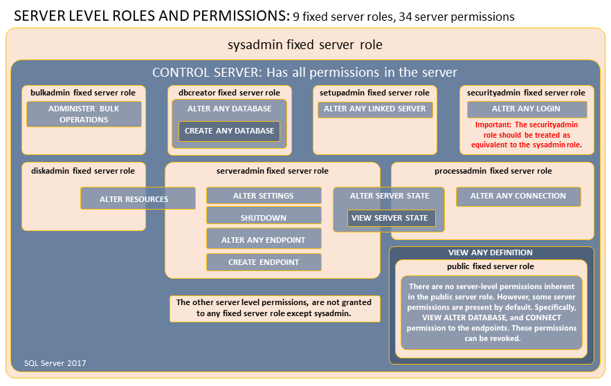
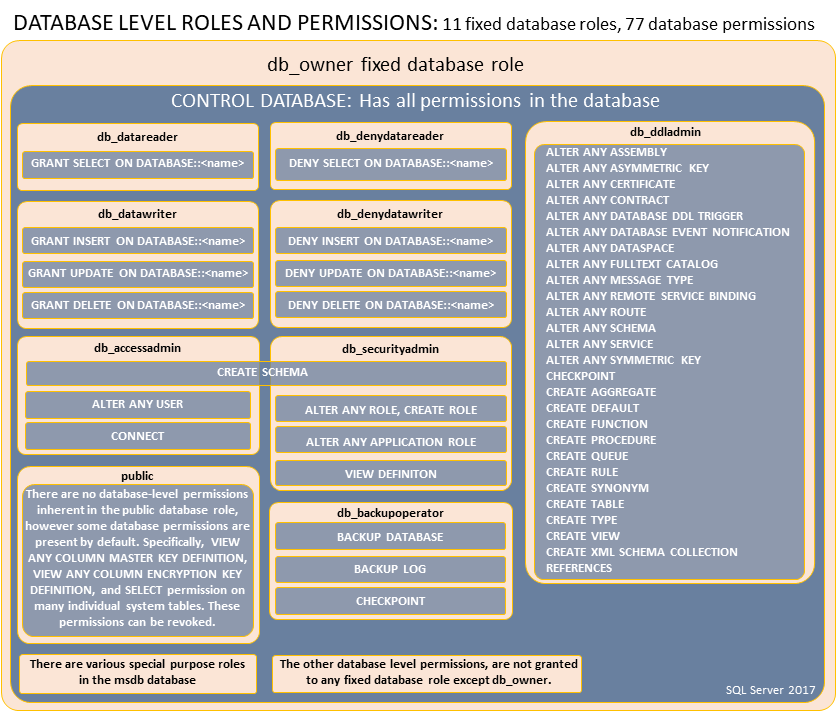

# SQL Server

<https://learn.microsoft.com/zh-cn/sql/sql-server/?view=sql-server-ver16>

## 安装数据库引擎

### Azure SQL

Azure SQL 系列中的三个产品包括：

- Azure SQL 数据库：支持对包含无服务器计算的智能、托管数据库服务使用新式云应用程序。
- Azure SQL 托管实例：大规模地实现现有 SQL Server 应用程序的现代化，其中智能且完全托管的实例用作服务，且与 SQL Server 数据库引擎之间的功能奇偶一致性几乎达 100%。最适合用于大部分云迁移方案。
- Azure VM 中的 SQL Server：轻松地直接迁移 SQL Server 工作负载，保持 100% 的 SQL Server 兼容性和操作系统级别的访问权限。

### 本地 SQL Server

## 客户端工具

### Azure Data Studio(ADS)

Azure Data Studio (ADS) 是一个跨平台的数据库工具，支持 Windows、macOS 和 Linux。它是一个轻量级的工具，专为 SQL Server、Azure SQL 数据库和 Azure SQL 数据仓库设计。

<https://learn.microsoft.com/zh-cn/azure-data-studio/?view=sql-server-ver16>

### SQL Server Management Studio(SSMS)

SQL Server Management Studio (SSMS) 是一个 Windows 专用的集成环境，用于管理 SQL Server 和 Azure SQL 数据库。

<https://learn.microsoft.com/zh-cn/sql/ssms/sql-server-management-studio-ssms?view=sql-server-ver16>

### SQL Server Data Tools (SSDT) for Visual Studio

SQL Server Data Tools (SSDT) 是一个 Visual Studio 的扩展，用于开发数据库应用程序。

<https://learn.microsoft.com/zh-cn/sql/ssdt/sql-server-data-tools?view=sql-server-ver16>

### Visual Studio Code 的 mssql 扩展

Visual Studio Code 的 mssql 扩展为 Azure SQL 和 SQL Server 提供查询功能，并为开发人员提供 SQL 项目和 Azure Functions 的 SQL 绑定的其他功能。

<https://learn.microsoft.com/zh-cn/sql/tools/visual-studio-code/mssql-extensions?view=sql-server-ver16>

#### 功能概述

##### VS Code 的 mssql 扩展中提供了以下功能

- 连接到 Microsoft SQL Server、Azure SQL 数据库、Azure SQL 托管实例和 Azure Synapse Analytics 专用 SQL 池。
- 创建和管理连接配置文件和最近使用的连接。
- 使用 IntelliSense、转到定义、T-SQL 代码片段、语法着色、T-SQL 错误验证和 GO 批处理分隔符编写 T-SQL 脚本。
- 执行脚本并在易于使用的网格中查看结果。
- 访问执行的查询历史记录。
- 将结果保存为 json 或 csv 文件格式并在编辑器中查看。
- 可自定义的扩展选项，包括命令快捷方式等。
- 使用 SQL 绑定创建 Azure Functions。

##### 比较 Azure Data Studio 和 mssql 扩展

Azure Data Studio 和 VS Code 的 mssql 扩展均适用于 Windows、macOS 和 Linux。

在 VS Code 中处理 Azure SQL 和 SQL Server 的好处包括：

- 可用于 SQL 和其他代码（例如 C#、Python、JavaScript、Java、PHP 和 Go）的单一代码编辑器。
- 广泛的扩展市场，具有用于远程开发、容器等的扩展。
- 可用于 GitHub Codespaces。

如果希望从以下功能中获益，则除了 VS Code 的 mssql 扩展之外，还可以考虑使用 Azure Data Studio：

- 快速创建图表和直观显示结果集
- 图形表设计器和查询计划。
- 数据库、SQL 项目和 dacpacs 的架构比较。
- SQL 代理、SQL Profiler 和平面文件导入的扩展。
- SQL 和 .NET 交互式笔记本。

### CLI

#### sqlcmd

sqlcmd 是一个命令行工具，用于执行 Transact-SQL 语句和脚本。

<https://learn.microsoft.com/zh-cn/sql/tools/sqlcmd/sqlcmd-utility?view=sql-server-ver16&tabs=go%2Cwindows&pivots=cs1-bash>

#### bcp

bcp 是一个命令行工具，用于大容量数据的导入和导出。

<https://learn.microsoft.com/zh-cn/sql/tools/bcp-utility?view=sql-server-ver16>

## 连接数据库

可以使用命名管道 (np)、共享内存 (lpc) 或 TCP/IP (tcp) 连接到本地计算机。共享内存是最快的，因为它不使用网络接口。

<https://learn.microsoft.com/zh-cn/sql/sql-server/connect-to-database-engine?view=sql-server-ver16&tabs=sqldb>

### 连接选项

```text
[<protocol>:]<instance>[,<port>]
```

## 安全性

### 安全主体

#### 登录

登录名是用于登录 SQL Server 数据库引擎的单个用户帐户。SQL Server 和 SQL 数据库支持基于 Windows 身份验证的登录名和基于 SQL Server 身份验证的登录名。

#### 角色

角色是一组权限的集合，可以将其分配给用户或其他角色。SQL Server 和 SQL 数据库支持服务器级角色、数据库级角色和应用程序角色。

#### 用户

通过在数据库中创建数据库用户并将该数据库用户映射到登录名来授予登录名对数据库的访问权限。通常，数据库用户名与登录名相同，尽管它不必要相同。每个数据库用户均映射到单个登录名。一个登录名只能映射到数据库中的一个用户，但可以映射为多个不同数据库中的数据库用户。

也可以创建不具有相应登录名的数据库用户。这些数据库用户称为“包含的数据库用户”。Microsoft 鼓励使用包含的数据库用户，因为这样可以更轻松地将你的数据库移到另一个服务器。与登录名类似，包含的数据库用户可以使用 Windows 身份验证或 SQL Server 身份验证。

#### SQL Server 级的主体

- SQL Server 身份验证登录名
- Windows 用户的 Windows 身份验证登录名
- Windows 组的 Windows 身份验证登录名
- Microsoft Entra 用户的 Microsoft Entra 身份验证登录
- Microsoft Entra 组的 Microsoft Entra 身份验证登录
- 服务器角色

#### 数据库级的主体

- 数据库用户（有 12 种类型的用户）
- 数据库角色
- 应用程序角色

#### sa 登录名

SQL Server `sa` 登录名是服务器级主体。默认情况下，该登录名是在安装实例时创建的。从 SQL Server 2005 (9.x) 开始，`sa` 的默认数据库为“master”。这是对早期版本的 SQL Server的行为的更改。`sa` 登录名是 `sysadmin` 固定服务器级别角色的成员。`sa` 登录名具有服务器上的所有权限，并且不能受到限制。`sa` 登录名无法删除，但可以禁用，以便任何人都无法使用它。

#### dbo 用户和 dbo 架构

`dbo` 用户是每个数据库中的特殊用户主体。所有 SQL Server 管理员、`sysadmin` 固定服务器角色成员、`sa` 登录名和数据库所有者，均以 `dbo` 用户身份进入数据库。`dbo` 用户有数据库中的所有权限，并且不能被限制或删除。`dbo` 代表数据库所有者，但 `dbo` 用户帐户与 `db_owner` 固定数据库角色不同，并且 `db_owner` 固定数据库角色与作为数据库所有者记录的用户帐户不同。
`dbo` 用户拥有 `dbo` 架构。`dbo` 架构是所有用户的默认架构，除非指定了其他某个架构。`dbo` 架构无法删除。

#### 公共服务器角色和数据库角色

每个登录名都属于 `public` 固定服务器角色，并且每个数据库用户都属于 `public` 数据库角色。当尚未为某个登录名或用户授予或拒绝为其授予对安全对象的特定权限时，该登录名或用户将继承已授予该安全对象的公共角色的权限。`public` 固定服务器角色和 `public` 固定服务器角色无法删除。但是，可以从 `public` 角色撤消权限。默认情况下有许多权限已分配给 `public` 角色。这些权限中的大部分是执行数据库中的日常操作（每个人都应能够执行的操作类型）所需的。从公共登录名或用户撤消权限时应十分小心，因为这将影响所有登录名/用户。通常不应拒绝公共登录名或用户的权限，因为 Deny 语句会覆盖你可能对个别登录名或用户设定的任何 Grant 语句。

#### guest 用户

每个数据库包括一个 `guest` 的行为的更改。授予 `guest` 用户的权限由对数据库具有访问权限，但在数据库中没有用户帐户的用户继承。无法删除 `guest` 用户，但可通过撤消其 CONNECT 权限将其禁用。可以通过在 `master` 或 `tempdb` 以外的任何数据库中执行 REVOKE CONNECT FROM GUEST; 来撤消 CONNECT 权限。

### 服务器级别角色

|服务器级的固定角色|说明|
|---|---|
|sysadmin|sysadmin 固定服务器角色的成员可以在服务器上执行任何活动。|
|serveradmin|serveradmin 固定服务器角色的成员可以更改服务器范围的配置选项和关闭服务器。|
|securityadmin|securityadmin 固定服务器角色的成员可以管理登录名及其属性。 他们可以 GRANT、DENY 和 REVOKE 服务器级权限。 他们还可以 GRANT、DENY 和 REVOKE 数据库级权限（如果他们具有数据库的访问权限）。 此外，他们还可以重置 SQL Server 登录名的密码。  重要提示：授予数据库引擎的访问权限和配置用户权限的能力使得安全管理员可以分配大多数服务器权限。 securityadmin 角色应视为与 sysadmin 角色等效。 或者，从 SQL Server 2022 (16.x) 开始，请考虑使用新的固定服务器角色 ##MS_LoginManager##。|
|processadmin|processadmin 固定服务器角色的成员可以终止在 SQL Server 实例中运行的进程。|
|setupadmin|setupadmin 固定服务器角色的成员可以使用 Transact-SQL 语句添加和删除链接服务器。 （使用 Management Studio 时需要 sysadmin 成员资格。）|
|bulkadmin|bulkadmin 固定服务器角色的成员可以运行 BULK INSERT 语句。  Linux 上的 SQL Server 不支持 bulkadmin 角色或 ADMINISTER BULK OPERATIONS 权限。 只有 sysadmin 才能对 Linux 上的 SQL Server 执行批量插入。|
|diskadmin|diskadmin 固定服务器角色用于管理磁盘文件。|
|dbcreator|dbcreator 固定服务器角色的成员可以创建、更改、删除和还原任何数据库。|
|public|每个 SQL Server 登录名都属于 public 服务器角色。 如果未向某个服务器主体授予或拒绝对某个安全对象的特定权限，用户将继承向 public 角色授予的对该对象的权限。 只有在希望所有用户都能使用对象时，才在对象上分配 Public 权限。 你无法更改具有 Public 角色的成员身份。  注意：public 与其他角色的实现方式不同，可通过 public 固定服务器角色授予、拒绝或调用权限。|

#### SQL Server 2022 中引入的固定服务器级角色

|服务器级的固定角色|说明|
|---|---|
|##MS_DatabaseConnector##|##MS_DatabaseConnector## 固定服务器角色的成员可连接到任何数据库，而无需数据库中的用户帐户即可连接。  若要拒绝对特定数据库的“连接”权限，用户可在数据库中为此登录创建匹配的用户帐户，然后拒绝对数据库用户的“连接”权限。 此“拒绝”权限将推翻来自此角色的“授予连接”权限。|
|##MS_LoginManager##|##MS_LoginManager## 固定服务器角色的成员可创建、删除和修改登录名。 与旧的固定服务器角色“securityadmin”相反，此角色不允许成员持有 `GRANT` 特权。 这是一个限制性较高的角色，有助于遵守“最低特权原则”。|
|##MS_DatabaseManager##|##MS_DatabaseManager## 固定服务器角色的成员可创建和删除数据库。 创建数据库的 ##MS_DatabaseManager## 角色的成员成为相应数据库的所有者，这样可便于用户以 `dbo` 用户身份连接到相应数据库。 `dbo` 用户具有数据库中的所有数据库权限。 ##MS_DatabaseManager## 角色的成员不一定具有访问非他们所有的数据库的权限。 此服务器角色与 SQL Server 中的 dbcreator 角色具有相同权限，但我们建议优先使用此新角色，而不是旧角色，因为此角色也存在于 Azure SQL 数据库中，有助于在不同的环境中使用相同脚本。|
|##MS_ServerStateManager##|##MS_ServerStateManager## 固定服务器角色的成员与##MS_ServerStateReader## 角色具有相同的权限。 此外，该角色还具有“变更服务器状态”权限，该权限允许访问多个管理操作，例如：`DBCC FREEPROCCACHE`、`DBCC FREESYSTEMCACHE ('ALL')`、`DBCC SQLPERF()`|
|##MS_ServerStateReader##|##MS_ServerStateReader## 固定服务器角色的成员可以读取“查看服务器状态”所涵盖的所有动态管理视图 (DMV) 和功能，分别拥有该角色的成员具有用户帐户的任何数据库上的“查看数据库状态”权限。|
|##MS_ServerPerformanceStateReader##|##MS_ServerPerformanceStateReader## 固定服务器角色的成员可以读取“查看服务器性能状态”所涵盖的所有动态管理视图 (DMV) 和功能，并分别对此角色的成员具有用户帐户的任何数据库拥有“查看数据库性能状态”权限。 这是 ##MS_ServerStateReader## 服务器角色有权访问的内容的一部分，有助于遵守“最低特权原则”。|
|##MS_ServerSecurityStateReader##|##MS_ServerSecurityStateReader## 固定服务器角色的成员可以读取“查看服务器安全状态”所涵盖的所有动态管理视图 (DMV) 和功能，并分别对角色的成员具有用户帐户的任何数据库拥有“查看数据库安全状态”权限。 这是 ##MS_ServerStateReader## 服务器角色有权访问的内容的一小部分，有助于遵守“最低特权原则”。|
|##MS_DefinitionReader##|##MS_DefinitionReader## 固定服务器角色的成员可以读取“查看任何定义”覆盖的所有目录视图，并分别对此角色的成员具有用户帐户的任何数据库拥有“查看定义”权限。|
|##MS_PerformanceDefinitionReader##|##MS_PerformanceDefinitionReader## 固定服务器角色的成员可以读取“查看任何性能定义”覆盖的所有目录视图，并分别对此角色的成员具有用户帐户的任何数据库拥有“查看性能定义”权限。 这是 ##MS_DefinitionReader## 服务器角色有权访问的内容的一部分。|
|##MS_SecurityDefinitionReader##|##MS_SecurityDefinitionReader## 固定服务器角色的成员可以读取“查看任何安全定义”覆盖的所有目录视图，并分别对此角色的成员拥有用户帐户的任何数据库拥有“查看安全定义”权限。 这是 ####MS_DefinitionReader#### 服务器角色有权访问的内容的一小部分，有助于遵守“最低特权原则”。|

|服务器级的固定角色|服务器级别权限|数据库级别权限|
|---|---|---|
|##MS_DatabaseConnector##|`CONNECT ANY DATABASE`|`CONNECT`|
|##MS_LoginManager##|`CREATE LOGIN`  `ALTER ANY LOGIN`|空值|
|##MS_DatabaseManager##|`CREATE ANY DATABASE`  `ALTER ANY DATABASE`|`ALTER`|
|##MS_ServerStateManager##|`ALTER SERVER STATE`  `VIEW SERVER STATE`  `VIEW SERVER PERFORMANCE STATE`  `VIEW SERVER SECURITY STATE`|`VIEW DATABASE STATE`  `VIEW DATABASE PERFORMANCE STATE`  `VIEW DATABASE SECURITY STATE`|
|##MS_ServerStateReader##|`VIEW SERVER STATE`  `VIEW SERVER PERFORMANCE STATE`  `VIEW SERVER SECURITY STATE`|`VIEW DATABASE STATE`  `VIEW DATABASE PERFORMANCE STATE`  `VIEW DATABASE SECURITY STATE`|
|##MS_ServerPerformanceStateReader##|`VIEW SERVER PERFORMANCE STATE`|`VIEW DATABASE PERFORMANCE STATE`|
|##MS_ServerSecurityStateReader##|`VIEW SERVER SECURITY STATE`|`VIEW DATABASE SECURITY STATE`|
|##MS_DefinitionReader##|`VIEW ANY DATABASE`  `VIEW ANY DEFINITION`  `VIEW ANY PERFORMANCE DEFINITION`  `VIEW ANY SECURITY DEFINITION`|`VIEW DEFINITION`  `VIEW PERFORMANCE DEFINITION`  `VIEW SECURITY DEFINITION`|
|##MS_PerformanceDefinitionReader##|`VIEW ANY PERFORMANCE DEFINITION`|`VIEW PERFORMANCE DEFINITION`|
|##MS_SecurityDefinitionReader##|`VIEW ANY SECURITY DEFINITION`|`VIEW SECURITY DEFINITION`|



### 数据库级别角色

|固定数据库角色名|说明|
|---|---|
|db_owner|db_owner 固定数据库角色的成员可以执行数据库的所有配置和维护活动，还可以 drop SQL Server 中的数据库。 （在 SQL 数据库 和 Synapse Analytics 中，某些维护活动需要服务器级别权限，并且不能由 db_owners 执行。）|
|db_securityadmin|db_securityadmin 固定数据库角色的成员可以仅修改自定义角色的角色成员资格和管理权限。 此角色的成员可能会提升其权限，应监视其操作。|
|db_accessadmin|db_accessadmin 固定数据库角色的成员可以为 Windows 登录名、Windows 组和 SQL Server 登录名添加或删除数据库访问权限。|
|db_backupoperator|db_backupoperator 固定数据库角色的成员可以备份数据库。|
|db_ddladmin|db_ddladmin 固定数据库角色的成员可以在数据库中运行任何数据定义语言 (DDL) 命令。 此角色的成员可以通过操作可能以高特权执行的代码来提升其特权，其操作应被监视。|
|db_datawriter|db_datawriter 固定数据库角色的成员可以在所有用户表中添加、删除或更改数据。 在大多数用例下，此角色将与 db_datareader 成员身份一起使用，以允许读取要修改的数据。|
|db_datareader|db_datareader 固定数据库角色的成员可以从所有用户表和视图中读取所有数据。 用户对象可能存在于除 sys 和 INFORMATION_SCHEMA 以外的任何架构中。|
|db_denydatawriter|db_denydatawriter 固定数据库角色的成员不能添加、修改或删除数据库内用户表中的任何数据。|
|db_denydatareader|db_denydatareader 固定数据库角色的成员不能读取数据库内用户表和视图中的任何数据。|



### 安全对象

#### 安全对象范围：服务器

**服务器**安全对象范围包含以下安全对象：

- 可用性组
- 终结点
- 登录
- 服务器角色
- 数据库

#### 安全对象范围：数据库

**数据库**安全对象范围包含以下安全对象：

- 应用程序角色
- 程序集
- 非对称密钥
- 证书
- 合约
- 全文目录
- 全文非索引字表
- 消息类型
- 远程服务绑定
- (数据库)角色
- 路由
- 架构
- 搜索属性列表
- 服务
- 对称密钥
- 用户

#### 安全对象范围：架构

**架构**安全对象范围包含以下安全对象：

- 类型
- XML 架构集合
- 对象 - 对象类包含以下成员：
  - 聚合
  - 函数
  - 过程
  - 队列
  - 同义词
  - 表
  - 查看
  - 外部表

#### 控制对安全对象的访问

接收对安全对象的权限的实体称为主体。最常见的主体是登录名和数据库用户。对安全对象的访问通过授予或拒绝权限进行控制，或者通过将登录名和用户添加到有权访问的角色进行控制。

### 权限

<https://learn.microsoft.com/zh-cn/sql/relational-databases/security/permissions-database-engine?view=sql-server-ver16&source=recommendations>

## 创建登录用户

### 创建登录

```sql
CREATE LOGIN <login_name> WITH PASSWORD='<password>' [DEFAULT_DATABASE = <database_name>]
```

DEFAULT_DATABASE
: 指定将指派给登录名的默认数据库。如果未包含此选项，则默认数据库设置为 master

### 创建用户

```sql
CREATE USER <user_name> FOR LOGIN <login_name> [WITH DEFAULT_SCHEMA = <schema_name>]
```

## 架构

```sql
CREATE SCHEMA <schema_name> [ AUTHORIZATION <owner_name> ]
```
