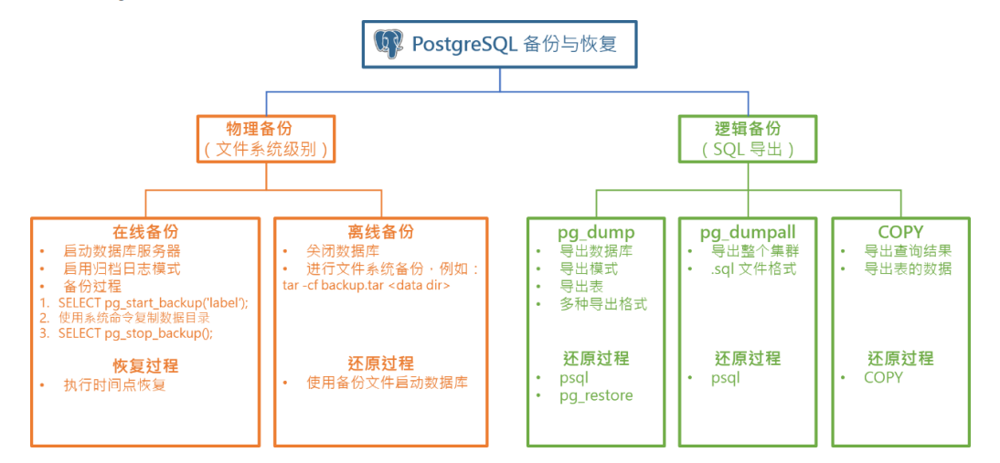

# 备份恢复



## 工具

- [pg_dump](https://www.postgresql.org/docs/current/app-pgdump.html)，逻辑备份工具，支持单个数据库（可以指定模式、表）的导出，可以选择导
出的格式。
- [pg_dumpall](https://www.postgresql.org/docs/current/app-pg-dumpall.html)，逻辑备份工具，用于导出整个数据库集群，包括公用的全局对象。
- [pg_basebackup](https://www.postgresql.org/docs/11/app-pgbasebackup.html)，物理备份工具，为数据库集群创建一个基准备份。它也可以用于时间点
恢复（point-in-time recovery）的基准备份，或者设置基于日志传输或流复制的从节点的
初始化。
- [psql](https://www.postgresql.org/docs/current/app-psql.html)，PostgreSQL 交互式命令行工具，也可以用于导入逻辑备份产生的 SQL 文件。
- [pg_restore](https://www.postgresql.org/docs/current/app-pgrestore.html)，逻辑还原工具，用于还原 pg_dump 导出的归档格式的备份文件。
- [COPY](https://www.postgresql.org/docs/current/sql-copy.html)，PostgreSQL专有的SQL语句，将表中的数据复制到文件，或者将文件中的数据
复制到表中。

## 逻辑备份

### pg_dump

pg_dump可以导出单个数据库、模式、表的数据

```bash
pg_dump [连接选项...][选项...][dbname]
```

支持的格式有：

- `plain`：纯文本格式，可以通过 psql 直接导入
- `custom`：自定义格式，可以通过 pg_restore 还原
- `directory`：目录格式，可以通过 pg_restore 还原
- `tar`：tar 格式，可以通过 pg_restore 还原

```bash
pg_dump -h localhost -p 5432 -U postgres -d testdb -f testdb.sql -F<format>
```

-f 文件
: 指定输出文件。省略则输出到标准输出

-F {p | c | d | t}
: 指定输出格式。默认为 p。p: 纯文本格式，c: 自定义格式，d: 目录格式，t: tar 格式

-j N
: 指定并行工作的进程数

#### 指定模式、表

-a
: 仅转储数据，而不转储架构（数据定义）

-n schema
: 指定要转储的模式

-N schema
: 指定要排除的模式

-t table
: 指定要转储的表

-T table
: 指定要排除的表

### pg_dumpall

pg_dumpall将集群的所有PostgreSQL数据库转储到一个脚本文件中

由于 pg_dumpall 从所有数据库读取表，因此很可能必须以数据库超级用户身份进行连接才能生成完整的转储。外，您还需要超级用户权限才能执行保存的脚本，以便被允许添加角色和创建数据库

```bash
pg_dumpall [连接选项...][选项...]
```

```sql
pg_dumpall -f cluster.sql
```

-f 文件
: 指定输出文件。省略则输出到标准输出

### pg_restore

pg_restore用于从pg_dump以非纯文本格式之一创建的存档中恢复PostgreSQL数据库。它将发出必要的命令，将数据库重建到保存时的状态

pg_restore可以在两种模式下运行。如果指定了数据库名称，则pg_restore将连接到该数据库，并将存档内容直接还原到数据库中。否则，将创建一个包含重新生成数据库所需的SQL命令的脚本，并将其写入文件或标准输出。此脚本输出等效于pg_dump的纯文本输出格式。因此，控制输出的一些选项类似于pg_dump选项

```bash
pg_restore [连接选项...][选项...][文件名]
```

```bash
pg_restore -C -d postgres db.dump
```

-C
: 创建数据库

-d dbname
: 指定要恢复的数据库

### psql

psql是PostgreSQL的交互式终端，也可以用于执行SQL脚本

```bash
psql [选项][数据库][用户名]
```

-c command
: 指定要执行的命令

-f file
: 指定要执行的SQL脚本文件

--csv
: 以CSV格式输出

-l
: 列出数据库

-o file
: 指定输出文件

### COPY

在文件和表之间复制数据

```sql
COPY <table_name> [ ( <column_name> [, ...] ) ]
    FROM { 'filename' | PROGRAM 'command' | STDIN }
    [ [ WITH ] ( <option> [, ...] ) ]
    [ WHERE condition ]

COPY { <table_name> [ ( <column_name> [, ...] ) ] | ( query ) }
    TO { 'filename' | PROGRAM 'command' | STDOUT }
    [ [ WITH ] ( <option> [, ...] ) ]

where option can be one of:

    FORMAT <format_name>
    FREEZE [ boolean ]
    DELIMITER 'delimiter_character'
    NULL 'null_string'
    DEFAULT 'default_string'
    HEADER [ boolean | MATCH ]
    QUOTE 'quote_character'
    ESCAPE 'escape_character'
    FORCE_QUOTE { ( <column_name> [, ...] ) | * }
    FORCE_NOT_NULL ( <column_name> [, ...] )
    FORCE_NULL ( <column_name> [, ...] )
    ENCODING 'encoding_name'
```

FORMAT
: 指定文件格式，如 csv、text(默认)、binary

## 物理备份

todo
